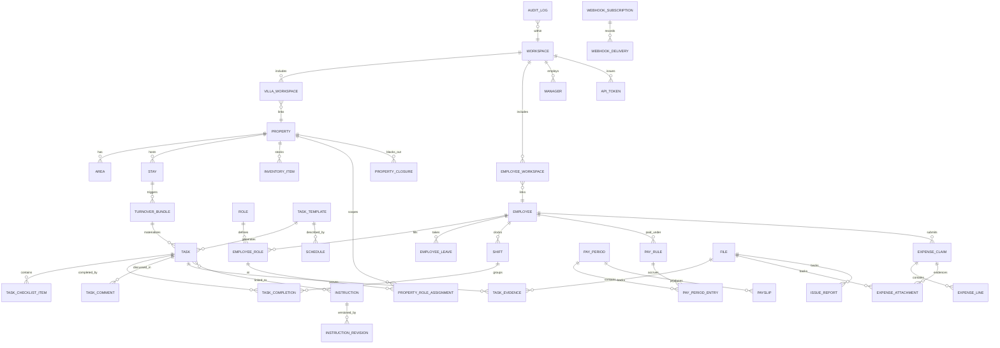

# 02 — Domain model

## Conventions

### Identifiers

- Every row uses a **ULID** primary key rendered as Crockford base32
  (26 chars, e.g. `01HXZ3...`). Stored as `CHAR(26)` in SQLite and
  `TEXT` / `uuid`-compatible in Postgres, never as an integer.
- ULIDs are **k-sortable** so we avoid adding a separate `created_at`
  index for time-range queries.
- Public URLs use ULIDs as-is; no separate slug table. Human-friendly
  references (e.g. `maid-maria`) are optional `handle` columns where
  useful, constrained unique per parent scope.

### Timestamps

- `created_at`, `updated_at` on every row. UTC.
- Business times (shift start/end, task due, stay check-in) that are
  logically local to a property carry a separate `timezone` column
  **on the parent property** — never on each row.
- `deleted_at` (nullable) implements **soft delete** on user-facing
  entities. Historical rows reference soft-deleted parents by ID;
  the UI hides them, the audit log never does.

### Soft delete policy

- All user-editable entities (Property, Employee, Role, Task,
  TaskTemplate, Instruction, InventoryItem, Stay) are **soft-deletable**.
- Children with a soft-deleted parent are **hidden** but their rows
  remain, so timesheets and audit log stay whole.
- Foreign keys between soft-deletable entities use
  `ON DELETE RESTRICT` at the DB level and a domain-level cascade that
  only ever soft-deletes. See skill `/new-fk-relationship`.
- `PUT /.../{id}/restore` (manager scope) reverses a soft delete.
- Hard delete is **admin-only** and available through a single dedicated
  CLI command (`miployees admin purge`) with a mandatory confirmation;
  it runs a trigger-based integrity check first.

### Naming

- Table names are **plural snake_case** (`tasks`, `task_templates`).
- Join tables `parents_children` (`employees_roles`).
- Enums are TEXT with a CHECK constraint in SQLite, native in Postgres.

### Tenancy seam

Every user-editable row carries `workspace_id CHAR(26) NOT NULL`.
(v0 called this column `household_id`; see the "Migration" note at
the bottom of this document.)

**Uniqueness constraints are scoped to `workspace_id` from day one.**
Any `UNIQUE` on a user-editable column is a composite unique on
`(workspace_id, <col>)`. Examples: `role.key`, `instruction.slug`,
`property.name`, `inventory_item.sku`. System-seeded catalog values
(capability keys, webhook event types) are globally unique because
they are not user-editable.

v1 ships with a single workspace row seeded at first boot; multi-
tenancy is then purely a matter of allowing more rows and adding RLS
in Postgres (§15). No code change elsewhere.

### Villa belongs to many workspaces

A `property` (informally "villa") is **not** owned by a single
workspace. The same physical place can appear in more than one
workspace simultaneously — for example a rental manager's workspace
and the owning family's workspace both see the same house. The link
is carried by the junction table `villa_workspace` below. Every
property still has a "primary" workspace (the one that created it),
but authorisation is expressed against the junction, not the primary.

### Employee belongs to many workspaces

Employees can work across villas that live in different workspaces.
Rather than derive workspace membership at query time, the schema
stores it explicitly in `employee_workspace`. Membership is derived
(an employee with at least one assigned villa in workspace W has a
row `employee_workspace(employee_id, W)`) but the materialised row
keeps uniqueness constraints, RLS filters (§15), and "list employees
of this workspace" queries fast and auditable.

## Entity catalog

Diagram in Mermaid (viewers without Mermaid support can read the
prose list below).

Entities in the diagram but not detailed inline here have their
columns defined in the section referenced in the catalog below.
`task_assignment` is not an entity — task assignment is captured as
`task.assigned_employee_id` (see §06). `capability_flag` is not an
entity either — capabilities are sparse JSON blobs on `role` and
`employee_role` (see §05).

### Core entities (by document)

- **Auth / identity** (§03): `manager`, `employee`, `passkey_credential`,
  `magic_link`, `break_glass_code`, `api_token`, `session`.
- **Places** (§04): `property`, `area`, `stay`, `guest_link`,
  `ical_feed`.
- **People & roles** (§05): `role`, `employee_role`,
  `property_role_assignment`.
- **Work** (§06): `task_template`, `schedule`, `task`,
  `task_checklist_item`, `task_completion`, `task_evidence`,
  `task_comment`, `turnover_bundle`, `employee_leave`,
  `property_closure`.
- **Instructions / SOPs** (§07): `instruction`, `instruction_revision`,
  `instruction_link`.
- **Inventory** (§08): `inventory_item`, `inventory_movement`.
- **Time / pay / expenses** (§09): `shift`, `pay_rule`, `pay_period`,
  `pay_period_entry`, `payslip`, `payout_destination`, `expense_claim`,
  `expense_line`, `expense_attachment`.
- **Comms** (§10): `digest_run`, `email_delivery`, `email_opt_out`,
  `webhook_subscription`, `webhook_delivery`, `issue_report`.
- **LLM** (§11): `model_assignment`, `llm_call`, `agent_action`,
  `anomaly_suppression`.
- **Files** (§02 "Shared tables", storage backend in §15): `file` —
  shared blob-reference table used by `task_evidence`,
  `expense_attachment`, `issue_report.attachment_file_ids`,
  `instruction_revision.attachment_file_ids`, and
  `employee.avatar_file_id`.
- **Cross-cutting** (§15): `audit_log`, `secret_envelope`.

There is no `person.*` event family or `person` row type. Managers
and employees emit their own events (`manager.*`, `employee.*`); see
§10.

Each subsequent document defines its entities' columns, invariants, and
state machines in detail. This file holds only the shared rules.

## Shared tables

### `workspaces`

(v0 name: `households`. The rename happens in the same migration that
introduces `workspace_id` on every user-editable table.)

| column        | type        | notes                              |
|---------------|-------------|------------------------------------|
| id            | ULID PK     | seeded at first boot               |
| name          | text        | displayed in UI                    |
| default_language | text     | BCP-47; used by §10 auto-translation and digest prose |
| created_at    | tstz        |                                    |
| settings_json | jsonb/text  | global instruction bank anchor, etc|

### `villa_workspace`

Junction table. A villa (`property`) can belong to more than one
workspace. One row per `(villa_id, workspace_id)` pair.

| column        | type    | notes                              |
|---------------|---------|------------------------------------|
| villa_id      | ULID FK | references `property.id`           |
| workspace_id  | ULID FK | references `workspace.id`          |
| added_at      | tstz    |                                    |
| added_by_kind | text    | `manager | agent | system`         |
| added_by_id   | ULID?   | nullable for system seeds          |

Primary key `(villa_id, workspace_id)`. On soft-delete of a villa
the junction rows remain (history is preserved); on workspace delete
the rows are hard-dropped.

### `employee_workspace`

Junction table. An employee is materialised in every workspace they
belong to; membership is derived from their assigned villas via
`employee_villa` (§05) plus any direct membership a manager adds.

| column        | type    | notes                              |
|---------------|---------|------------------------------------|
| employee_id   | ULID FK |                                    |
| workspace_id  | ULID FK |                                    |
| source        | text    | `villa` (derived) \| `direct` (manager-added) |
| added_at      | tstz    |                                    |

Primary key `(employee_id, workspace_id)`. A worker job refreshes
`source = 'villa'` rows whenever an `employee_villa` row is
inserted/removed, in the same transaction.

### `audit_log`

Append-only. Written in the same transaction as every mutation.

| column             | type    | notes                                 |
|--------------------|---------|---------------------------------------|
| id                 | ULID PK |                                       |
| workspace_id       | ULID FK |                                       |
| correlation_id     | ULID    | request-level by default; groups multi-row edits |
| occurred_at        | tstz    |                                       |
| actor_kind         | text    | `manager`, `employee`, `agent`, `system` |
| actor_id           | ULID    | nullable only for `system`            |
| via                | text    | `web`, `api`, `cli`, `worker`         |
| token_id           | ULID    | nullable; populated for `api`/`cli`   |
| action             | text    | `task.create`, `task.complete`, etc.  |
| entity_kind        | text    | `task`, `employee`, ...               |
| entity_id          | ULID    |                                       |
| before_json        | jsonb   | nullable (create)                     |
| after_json         | jsonb   | nullable (delete)                     |
| reason             | text    | optional, agent-supplied              |

**Correlation scope.** `correlation_id` defaults to the HTTP request
ID (generated server-side if the caller did not pass
`X-Correlation-Id`). A caller that wants to group multiple HTTP
requests into one logical workflow may pass the same
`X-Correlation-Id` on each; the server does not validate grouping
semantics. `audit_log` rows emitted by a single transaction always
share the same `correlation_id`.

Retention: default 2 years; configurable per workspace. Worker job
`rotate_audit_log` moves rows older than retention into
`audit_log_archive.jsonl.gz` under `$DATA_DIR/archive/`.

### `file`

Shared blob reference row. The backend storage driver is pluggable
(local disk in v1, S3/GCS post-v1); the row is the durable identifier.

| column           | type    | notes                                  |
|------------------|---------|----------------------------------------|
| id               | ULID PK |                                        |
| workspace_id     | ULID FK |                                        |
| sha256           | text    | content hash; unique per workspace     |
| byte_size        | int     |                                        |
| mime_type        | text    | server-sniffed (§15)                   |
| original_name    | text    | user-supplied; never trusted for paths |
| storage_driver   | text    | `local` (v1) \| `s3` (post-v1)         |
| storage_key      | text    | driver-specific locator                |
| uploaded_by_kind | text    | `manager` \| `employee` \| `agent`     |
| uploaded_by_id   | ULID    |                                        |
| created_at       | tstz    |                                        |
| deleted_at       | tstz?   |                                        |

Local driver writes to `$DATA_DIR/files/{workspace_id}/{sha256[0:2]}/
{sha256}`. See §15 for MIME sniffing, EXIF stripping, and PDF script
rejection.

### `secret_envelope`

Per-workspace AES-GCM-encrypted blobs for secret values we must store
(OpenRouter API key, SMTP password, iCal feed URLs that carry tokens).
See §15.

## Schema evolution rules

- Every change ships as an **Alembic migration** in `migrations/`, with
  a short doc comment explaining intent.
- Additive migrations (new column nullable, new table, new enum value)
  deploy without downtime.
- Destructive migrations (drop column, narrow type) are a **two-release
  dance**: release N deprecates the column and stops reading it,
  release N+1 drops it.
- Every migration includes a downgrade unless it is lossy; lossy
  migrations say so explicitly and fail downgrade with a clear message.
- Backfills >1M rows run in the **worker**, not inline in the migration.
- See `/new-migration` skill for the complete checklist (column types,
  indexes, backfill, downgrade, idempotency).

## Portability (SQLite ↔ Postgres)

- Use only SQLAlchemy 2.x core expressions. No raw dialect SQL outside
  `app/adapters/db/`.
- JSON fields: SQLAlchemy `JSON` type maps to `jsonb` on Postgres and
  `TEXT` on SQLite. Queries against JSON fields live behind helper
  functions in `adapters/db/`.
- Full-text search:
    - SQLite: FTS5 virtual tables built from triggers.
    - Postgres: `GIN (tsvector)`.
    - Single query interface `search.search_tasks(q, scope)` picks the
      right backend.
- Transactions must hold for single logical operations and must not
  hold across LLM calls (see §11).

## Derived fields

Derived fields are computed and persisted **only** when recomputing on
read is too expensive:

- `task.scheduled_for_local` — stored alongside UTC for fast day-view
  queries.
- `shift.duration_seconds` — populated on clock-out.
- `expense_claim.total_amount_cents` — recomputed on line add/remove.
- `inventory_item.on_hand` — recomputed on every movement, in the same
  transaction.

A `--recompute` CLI command recomputes all derived fields; a periodic
CI job asserts no drift in test fixtures.

## Money

- All money stored as **integer cents** plus ISO-4217 `currency` (text)
  on the owning row. No floats.
- Per-workspace `default_currency`. Per-property override allowed.
- Multi-currency payroll is out of scope; expenses may be in any
  currency, converted to the workspace default at approval time using
  the snapshot rate stored on the expense line.

## Enums (canonical list)

Defined once per document where the enum lives; summarized here.

- `actor_kind`: `manager | employee | agent | system`
- `task_state`: `scheduled | pending | in_progress | completed | skipped | cancelled | overdue`
- `stay_source`: `manual | airbnb | vrbo | booking | google_calendar | ical`
- `pay_rule_kind`: `hourly | monthly_salary | per_task | piecework`
- `pay_period_status`: `open | locked | paid`
- `payslip_status`: `draft | issued | paid | voided`
- `shift_status`: `open | closed | disputed`
- `expense_state`: `draft | submitted | approved | rejected | reimbursed`
- `expense_line_source`: `ocr | manual` (see §09 for interaction with `edited_by_user`)
- `inventory_movement_reason`: `restock | consume | adjust | waste | transfer_in | transfer_out | audit_correction`
- `delivery_state`: `queued | sent | delivered | bounced | failed`
- `property_kind`: `residence | vacation | str | mixed` (semantics in §04)
- `capability`: see §05.

## Full-text search ranking

The unified `search.search_tasks(q, scope)` interface returns rows
ranked by a simple weighted sum:

- title: weight 4
- checklist item text: weight 2
- description_md: weight 2
- completion_note_md: weight 1
- task_comment.body_md: weight 1

SQLite uses FTS5 `bm25()` with the same weight vector; Postgres uses
`ts_rank_cd` against a `tsvector` built with the same weights.

## Operational-log retention defaults

| table              | default retention | note                              |
|--------------------|-------------------|-----------------------------------|
| `audit_log`        | 2 years           | see above; archived to JSONL.gz   |
| `session`          | 90 days after revocation | §03                        |
| `llm_call`         | 90 days           | configurable per workspace (§11)  |
| `email_delivery`   | 90 days           | configurable per workspace (§10)  |
| `webhook_delivery` | 90 days           | configurable per workspace (§10)  |

Retention is enforced by worker job `rotate_operational_logs` (daily).
All durations are workspace-level settings; raising a duration takes
effect immediately, lowering it purges on next rotation.

## Migration (v0 household → v1 workspace)

v1 renames the tenancy boundary from `household` to `workspace`
across the entire schema, API, and UI. Concretely:

- The `households` table becomes `workspaces`.
- Every `household_id` column becomes `workspace_id`.
- The two new junction tables `villa_workspace` and
  `employee_workspace` are introduced; the seeded v1 deployment
  back-fills one row per existing `(property, workspace)` and one row
  per `(employee, workspace)` with `source = 'villa'` where
  applicable, plus `'direct'` for any employee with no villa
  assignment.
- v1 still ships **single-workspace**: a fresh install seeds exactly
  one `workspaces` row at first boot and all tooling assumes that
  row for defaults. The schema names are already plural-safe, so
  flipping on true multitenancy later is purely an auth change
  (§15) plus row-inserts — no table rename, no column rename, no
  data migration.
- Historical references in this repository (roadmap entries, v0
  migration notes, §20 glossary) still say "household" when they are
  explicitly describing v0 behaviour. New code and new docs must use
  "workspace".
