# 02 — Domain model

## Conventions

### Identifiers

- Every row uses a **ULID** primary key rendered as Crockford base32
  (26 chars, e.g. `01HXZ3...`). Stored as `CHAR(26)` in SQLite and
  `TEXT` / `uuid`-compatible in Postgres, never as an integer.
- ULIDs are **k-sortable** so we avoid adding a separate `created_at`
  index for time-range queries.
- Public URLs use ULIDs as-is; no separate slug table. Human-friendly
  references (e.g. `maid-maria`) are optional `handle` columns where
  useful, constrained unique per parent scope.

### Timestamps

- `created_at`, `updated_at` on every row. UTC.
- Business times (booking start/end, task due, stay check-in) that are
  logically local to a property carry a separate `timezone` column
  **on the parent property** — never on each row.
- `deleted_at` (nullable) implements **soft delete** on user-facing
  entities. Historical rows reference soft-deleted parents by ID;
  the UI hides them, the audit log never does.

### Soft delete policy

- All user-editable entities (Property, Unit, Employee, Role, Task,
  TaskTemplate, Instruction, InventoryItem, Stay) are **soft-deletable**.
- Children with a soft-deleted parent are **hidden** but their rows
  remain, so timesheets and audit log stay whole.
- Foreign keys between soft-deletable entities use
  `ON DELETE RESTRICT` at the DB level and a domain-level cascade that
  only ever soft-deletes. See skill `/new-fk-relationship`.
- `PUT /.../{id}/restore` (manager scope) reverses a soft delete.
- Hard delete is **admin-only** and available through a single dedicated
  CLI command (`crewday admin purge`) with a mandatory confirmation;
  it runs a trigger-based integrity check first.

### Naming

- Table names are **plural snake_case** (`tasks`, `task_templates`).
- Join tables `parents_children` (`users_work_roles`).
- Enums are TEXT with a CHECK constraint in SQLite, native in Postgres.

### Tenancy seam

Every user-editable row carries `workspace_id CHAR(26) NOT NULL`.
(v0 called this column `household_id`; see the "Migration" note at
the bottom of this document.)

**Uniqueness constraints are scoped to `workspace_id` from day one.**
Any `UNIQUE` on a user-editable column is a composite unique on
`(workspace_id, <col>)`. Examples: `role.key`, `instruction.slug`,
`property.name`, `inventory_item.sku`. System-seeded catalog values
(capability keys, webhook event types) are globally unique because
they are not user-editable.

v1 is **multi-tenant from day 1** (§00 G11). A single deployment
holds many `workspace` rows simultaneously on any supported
backend; every authenticated URL lives under
`<host>/w/<workspace_slug>/...` (§01 "Multi-tenancy runtime",
§14). The managed SaaS at `crew.day` provisions one workspace
per self-serve signup (§03, §15); self-hosted deployments start
with zero workspaces and grow via the same signup path, a
managed admin flow (`crewday admin workspace create`), or an
invite.

Tenant isolation is enforced at the application layer on every
backend: every repository call filters by `ctx.workspace_id`.
Where the backend supports it (Postgres, capability `features.rls`
— §01), policies on each workspace-scoped table read
`current_setting('crewday.workspace_id')` as defence-in-depth.
SQLite lacks RLS and relies on the application-level filter
alone; the cross-tenant regression test in §17 runs on both
backends to catch any drift.

The `WorkspaceContext` (defined in §01) is the request-scoped
carrier every domain service function takes as its first argument;
it is the source of truth for `workspace_id` in every query and
audit row.

### Villa belongs to many workspaces

A `property` (informally "villa") is **not** owned by a single
workspace. The same physical place can appear in more than one
workspace simultaneously — for example a rental manager's workspace
and the owning family's workspace both see the same house. The link
is carried by the junction table `property_workspace` below. Every
property still has a "home" workspace (the one that created it),
but authorisation is expressed against the junction plus the
identity model below, not against the home workspace alone.

### Unified identity

v1 replaces the v0 split between `manager` and `employee` with a
single `users` table. Each person is represented by exactly one
`users` row (one login identity, one passkey set, one email),
regardless of whether they are the head of a household, a maid, a
driver, a billing client, or all four at once on different scopes.

Permissions are split in two, deliberately:

- **Surface (persona, data filter).** `role_grants` rows with
  `grant_role ∈ {manager, worker, client, guest}` — which UI
  shell the user sees and which rows RLS (§15) lets them read.
- **Authority (who may do what).** Membership in
  `permission_group` plus rules on `permission_rule` targeting
  an `action_key` — a purely reverse, action-first model.
  Governance lives in the `owners` permission group on each
  scope (≥1 member invariant replaces the v0 "exactly one
  `owner` grant" rule). See "Shared tables → `role_grants`",
  "Shared tables → `permission_group`", "Shared tables →
  `permission_rule`", plus §03 (auth) and §05 (work roles,
  capabilities, action catalog).

This collapses three things that used to be separate in v0:

- v0 `manager` rows (logins with workspace-wide authority).
- v0 `employee` rows (logins with task-scoped authority).
- `organization.portal_user_id` (reserved future seam for a client
  to log in; now subsumed by a `role_grants` row with
  `scope_kind = 'organization'` or with `grant_role = 'client'` on
  a workspace / property).

The term "employee" is retained only as a **domain term** for a
person who performs work under a `work_engagement` (§22) — it is
no longer an entity in the schema. New code and new specs refer to
`users`, their `role_grants`, and the `permission_group` /
`permission_rule` pair.

### User belongs to many workspaces

A user may be active in multiple workspaces at once: a `role_grants`
row on a workspace, on one of that workspace's properties, or on an
organization linked to it. Rather than derive workspace membership
at query time, the schema stores it explicitly in `user_workspace`
(materialized junction, see below) so RLS filters (§15) and
"list users of this workspace" queries stay fast and auditable.

## Entity catalog

Diagram in Mermaid (viewers without Mermaid support can read the
prose list below).

```mermaid
erDiagram
    WORKSPACE ||--o{ PROPERTY_WORKSPACE : includes
    WORKSPACE ||--o{ USER_WORKSPACE : includes
    WORKSPACE ||--o{ WORK_ENGAGEMENT : employs
    WORKSPACE ||--o{ API_TOKEN : issues

    USER ||--o{ ROLE_GRANT : holds
    USER ||--o{ USER_WORKSPACE : derived_from_grants
    USER ||--o{ WORK_ENGAGEMENT : earns_under
    USER ||--o{ USER_WORK_ROLE : fills
    USER ||--o{ PASSKEY_CREDENTIAL : authenticates_with
    USER ||--o{ PERMISSION_GROUP_MEMBER : belongs_to

    ROLE_GRANT }o--|| WORKSPACE : may_scope_to
    ROLE_GRANT }o--|| PROPERTY : may_scope_to
    ROLE_GRANT }o--|| ORGANIZATION : may_scope_to

    WORKSPACE ||--o{ PERMISSION_GROUP : hosts
    ORGANIZATION ||--o{ PERMISSION_GROUP : hosts
    PERMISSION_GROUP ||--o{ PERMISSION_GROUP_MEMBER : contains
    PERMISSION_GROUP ||--o{ PERMISSION_RULE : subject_of
    USER ||--o{ PERMISSION_RULE : subject_of
    WORKSPACE ||--o{ PERMISSION_RULE : scopes
    PROPERTY ||--o{ PERMISSION_RULE : scopes
    ORGANIZATION ||--o{ PERMISSION_RULE : scopes

    PROPERTY_WORKSPACE }o--|| PROPERTY : links
    USER_WORKSPACE }o--|| USER : links

    PROPERTY ||--o{ UNIT : contains
    PROPERTY ||--o{ AREA : has
    PROPERTY ||--o{ INVENTORY_ITEM : stocks
    PROPERTY ||--o{ PROPERTY_WORK_ROLE_ASSIGNMENT : scopes
    PROPERTY ||--o{ PROPERTY_CLOSURE : blacks_out

    UNIT ||--o{ AREA : has
    UNIT ||--o{ STAY : hosts
    UNIT ||--o{ STAY_LIFECYCLE_RULE : configured_by

    WORK_ROLE ||--o{ USER_WORK_ROLE : defines
    USER_WORK_ROLE ||--o{ PROPERTY_WORK_ROLE_ASSIGNMENT : at
    USER ||--o{ EMPLOYEE_LEAVE : takes
    USER ||--o{ EMPLOYEE_AVAILABILITY_OVERRIDE : adjusts

    WORKSPACE ||--o{ PUBLIC_HOLIDAY : observes

    TASK_TEMPLATE ||--o{ TASK : generates
    TASK_TEMPLATE ||--o{ SCHEDULE : described_by
    TASK ||--o{ TASK_CHECKLIST_ITEM : contains
    TASK ||--o{ TASK_COMPLETION : completed_by
    TASK ||--o{ TASK_COMMENT : discussed_in
    TASK ||--o{ TASK_EVIDENCE : proves
    TASK }o--o{ INSTRUCTION : linked_to

    STAY ||--o{ STAY_TASK_BUNDLE : triggers
    STAY_TASK_BUNDLE ||--o{ TASK : materializes

    WORK_ENGAGEMENT ||--o{ BOOKING : commits
    BOOKING ||--o{ TASK_COMPLETION : groups

    WORK_ENGAGEMENT ||--o{ PAY_RULE : paid_under
    PAY_RULE ||--o{ PAY_PERIOD_ENTRY : accrues
    PAY_PERIOD ||--o{ PAY_PERIOD_ENTRY : contains
    PAY_PERIOD ||--o{ PAYSLIP : produces

    WORK_ENGAGEMENT ||--o{ EXPENSE_CLAIM : submits
    EXPENSE_CLAIM ||--o{ EXPENSE_LINE : contains
    EXPENSE_CLAIM ||--o{ EXPENSE_ATTACHMENT : evidences

    INSTRUCTION ||--o{ INSTRUCTION_REVISION : versioned_by

    FILE ||--o{ TASK_EVIDENCE : backs
    FILE ||--o{ EXPENSE_ATTACHMENT : backs
    FILE ||--o{ ISSUE : backs

    WEBHOOK_SUBSCRIPTION ||--o{ WEBHOOK_DELIVERY : records

    AUDIT_LOG }o--|| WORKSPACE : within

    WORKSPACE ||--o{ ORGANIZATION : knows
    ORGANIZATION ||--o{ PROPERTY : bills
    ORGANIZATION ||--o{ WORK_ENGAGEMENT : supplies
    ORGANIZATION ||--o{ CLIENT_RATE : priced_at
    ORGANIZATION ||--o{ CLIENT_USER_RATE : overrides
    ORGANIZATION ||--o{ PAYOUT_DESTINATION : receives

    PROPERTY ||--o{ WORK_ORDER : hosts
    WORK_ORDER ||--o{ TASK : groups
    WORK_ORDER ||--o{ QUOTE : priced_by
    WORK_ORDER ||--o{ VENDOR_INVOICE : billed_by

    USER ||--o{ QUOTE : submits
    USER ||--o{ VENDOR_INVOICE : bills

    BOOKING ||--o| BOOKING_BILLING : rolled_up_to
```



Entities in the diagram but not detailed inline here have their
columns defined in the section referenced in the catalog below.
`task_assignment` is not an entity — task assignment is captured as
`task.assigned_user_id` (see §06). Worker-facing operational policy
is resolved through the structured settings cascade below; there is
no separate runtime "capability" resolver. Authority
(who-may-do-what) lives on the `permission_rule` + action
catalog pair (see `permission_rule` below and the catalog in
§05).

### Core entities (by document)

- **Auth / identity** (§03): `user`, `role_grant`, `passkey_credential`,
  `magic_link`, `break_glass_code`, `api_token`, `session`.
- **Permissions** (§02, §05): `permission_group`,
  `permission_group_member`, `permission_rule`. Governance anchor is
  the `owners` group on each scope; rule resolution is documented
  inline above.
- **Places** (§04): `property`, `unit`, `area`, `stay`, `guest_link`,
  `ical_feed`.
- **People, work roles, engagements** (§05, §22): `work_role`,
  `user_work_role`, `property_work_role_assignment`,
  `work_engagement`.
- **Work** (§06): `task_template`, `schedule`, `task`,
  `task_checklist_item`, `task_completion`, `task_evidence`,
  `task_comment`, `stay_lifecycle_rule`, `stay_task_bundle`,
  `employee_leave`, `employee_availability_override`,
  `public_holiday`, `property_closure`. (`employee_*` table names
  are retained for historical continuity; they now store rows
  keyed by `user_id` rather than a separate `employee_id`.)
- **Instructions / SOPs** (§07): `instruction`, `instruction_revision`,
  `instruction_link`.
- **Inventory** (§08): `inventory_item`, `inventory_movement`.
- **Time / pay / expenses** (§09): `booking`, `pay_rule`, `pay_period`,
  `pay_period_entry`, `payslip`, `payout_destination`, `expense_claim`,
  `expense_line`, `expense_attachment`. All pay-pipeline rows
  reference `work_engagement_id` (not `user_id` directly), so the
  same person on different workspaces bills/accrues independently.
- **Clients, vendors, work orders** (§22): `organization`,
  `client_rate`, `client_user_rate`, `booking_billing`,
  `work_order`, `quote`, `vendor_invoice`,
  `property_workspace_invite` (two-sided invite/accept flow for
  sharing a property across workspaces).
  `payout_destination` is shared with §09; destinations may be
  owned by a user **or** an organization.
- **Comms** (§10): `digest_run`, `email_delivery`, `email_opt_out`,
  `webhook_subscription`, `webhook_delivery`, `issue`.
- **Assets** (§21): `asset_type`, `asset`, `asset_action`,
  `asset_document`.
- **LLM** (§11): `llm_provider`, `llm_model`, `llm_provider_model`,
  `llm_assignment`, `llm_capability_inheritance`,
  `llm_prompt_template`, `llm_prompt_template_revision`, `llm_call`,
  `llm_usage_daily`, `agent_action`, `anomaly_suppression`,
  `agent_preference`, `agent_preference_revision`.
- **Files** (§02 "Shared tables", storage backend in §15): `file` —
  shared blob-reference table used by `task_evidence`,
  `expense_attachment`, `issue.attachment_file_ids`,
  `instruction_revision.attachment_file_ids`, and
  `user.avatar_file_id`.
- **Cross-cutting** (§15): `audit_log`, `secret_envelope`.

All human mutations emit `user.*` events. Non-human actors (scoped
agents, the worker) emit `agent.*` / `system.*` events. There is no
`manager.*` or `employee.*` event family.

Each subsequent document defines its entities' columns, invariants, and
state machines in detail. This file holds only the shared rules.

## Shared tables

### `workspaces`

(v0 name: `households`. The rename happens in the same migration that
introduces `workspace_id` on every user-editable table.)

| column             | type        | notes                                                                                          |
|--------------------|-------------|------------------------------------------------------------------------------------------------|
| id                 | ULID PK     | generated at provisioning                                                                      |
| slug               | text UNIQUE | canonical URL identifier (`<host>/w/<slug>/...`). Regex `^[a-z][a-z0-9-]{1,38}[a-z0-9]$`, reserved-word blocklist (see §01). Immutable after creation. Globally unique across the deployment. |
| name               | text        | displayed in UI; editable                                                                      |
| plan               | text        | `free \| pro \| enterprise \| unlimited`. Enforced by the quota gate (§15). v1 ships every SaaS workspace on `free`; self-host operators typically assign `unlimited` to their own workspaces via `crewday admin workspace set-plan`. Paid-tier enforcement (Stripe, dunning) is Beyond v1 — §19. |
| quota_json         | jsonb/text  | caps actually enforced: `{users_max, properties_max, storage_bytes, llm_budget_cents_30d}`. Derived from `plan` on provisioning; editable by deployment operator via `crewday admin workspace set-quota`. |
| created_via        | text        | `self_serve \| admin_invite \| admin_init \| seed`. Drives first-run UI + quota tightening.    |
| verification_state | text        | `unverified \| email_verified \| human_verified \| trusted \| archived`. Self-serve tenants stay below `human_verified` under tight quotas until a manager approves. `archived` is a terminal state reachable via `crewday admin workspace archive` (§13); archived workspaces are read-only, hold their slug in `slug_reservation` for 30 days, and can be unarchived atomically within the window. See §03, §15. |
| created_at         | tstz        |                                                                                                |
| created_by_user_id | ULID FK?    | provisioning user (the first owner); null for seeded rows                                      |
| signup_ip          | inet?       | source IP captured at `POST /signup/start` for self-serve workspaces; null for `admin_invite`, `admin_init`, `seed`. Indexed (IPv4 full; IPv6 as `/64` prefix) for the per-IP aggregate LLM-spend cap (§15). Retained for audit; `verification_state = human_verified` promotes the workspace out of the aggregate pool. |
| default_language   | text        | BCP-47; used by §10 auto-translation and digest prose                                          |
| default_currency   | text        | ISO-4217. Referenced by Money section below; per-property override in §04.                     |
| default_country    | text        | ISO-3166-1 alpha-2. Workspace-level fallback for properties.                                   |
| default_locale     | text?       | BCP-47 locale tag (e.g. `fr-FR`). Nullable; when null, derived from `default_language` + `default_country`. Drives number/date/currency formatting on workspace-scoped documents. |
| settings_json      | jsonb/text  | flat map of `dotted.key → value`; holds concrete workspace defaults for every registered setting (see "Settings cascade" below) |

**Slug invariants.** Slugs are globally unique across the
deployment (not `(workspace_id, slug)`, since the slug *is* the
workspace identifier in the URL). The reserved-word blocklist is
`w, api, admin, signup, login, recover, select-workspace, healthz,
readyz, version, docs, redoc, styleguide, unsupported, static,
assets` (kept in sync with §01). Case-insensitive on input,
stored lowercase. On collision, the signup API returns
`409 slug_taken` with a suggested variant.

**Plan + quota.** `plan` is authoritative for which quotas apply;
`quota_json` is the materialised snapshot actually enforced — the
free-tier caps are copied in on provisioning so operator overrides
are explicit. Hitting a quota cap returns `402 quota_exceeded`
from the relevant API route; the UI renders the cap banner with a
contact-your-operator CTA. Payment processing is out of scope for
v1 (§00 N1).

**Verification state.** `unverified` → `email_verified` after
magic-link acceptance; → `human_verified` after first manager
passkey enrollment and a minimum-activity gate (one property,
one user invited, one task created); → `trusted` only when the
deployment operator promotes the workspace. Per-state LLM and
storage caps live in §15.

### `slug_reservation`

Holding area for workspace slugs that are temporarily off-limits
even though no live `workspaces` row carries them — the grace
period referenced by §03's reserved-slug logic (see §03
"Self-serve signup" and `409 slug_in_grace_period`).

| column                | type        | notes                                                 |
|-----------------------|-------------|-------------------------------------------------------|
| id                    | ULID PK     |                                                       |
| slug                  | text UNIQUE NOT NULL | matches the §02 slug regex; normalised to lowercase on insert |
| reserved_until        | tstz NOT NULL | 30 days after the triggering event; past-dated rows are pruned by `signup_gc` (§03) |
| reason                | text NOT NULL | CHECK: `reason IN ('archived', 'hard_deleted', 'system_reserved', 'homoglyph_guard')` |
| previous_workspace_id | ULID FK? ON DELETE SET NULL | references `workspaces.id`; nullable for `reason = 'system_reserved'` (new labels reserved ahead of a planned release) |
| created_at            | tstz NOT NULL |                                                      |

**Purpose.** A `POST /signup/start` whose `desired_slug`
collides with a live `slug_reservation` returns `409
slug_in_grace_period` with the `reserved_until` value in the
error body, so the signup UI can explain when the slug becomes
available. A manager who archives a workspace by mistake can
recover the slug within the window via `crewday admin workspace
unarchive` (§13), which deletes the reservation atomically.

**Reasons:**

- `archived` — workspace transitioned to `verification_state =
  'archived'`. The slug cannot be re-used for 30 days after the
  archive event to avoid a new workspace impersonating the old
  one while cached links still point at it.
- `hard_deleted` — workspace row was hard-deleted (operator
  action via `crewday admin workspace purge`). Same 30-day
  hold.
- `system_reserved` — pre-seeded labels reserved ahead of a
  planned release (e.g. a future route `/marketplace` pinning
  `marketplace` so no one registers it as a workspace). Never
  expires in practice (`reserved_until` set to
  `9999-12-31T00:00:00Z`).
- `homoglyph_guard` — added by the homoglyph rejection path
  (§03) when a look-alike variant of an active slug is
  submitted; the variant is held for the 30-day window so the
  attacker cannot retry immediately.

### `property_workspace`

Junction table. A property can belong to more than one workspace.
One row per `(property_id, workspace_id)` pair.

| column                | type    | notes                                                    |
|-----------------------|---------|----------------------------------------------------------|
| property_id           | ULID FK | references `property.id`                                 |
| workspace_id          | ULID FK | references `workspace.id`                                |
| membership_role       | text    | `owner_workspace \| managed_workspace \| observer_workspace` (see below) |
| share_guest_identity  | bool    | `false` by default. When true, managers on this workspace see the stay's guest name, contact, and welcome-page fields otherwise redacted by the cross-workspace PII boundary (§15). Copied from the accepted `property_workspace_invite.initial_share_settings_json` (§22) at materialisation. Only editable on non-owner rows — the `owner_workspace` always sees everything at its own property. |
| invite_id             | ULID FK?| `property_workspace_invite.id` that materialised this row; null for the bootstrap `owner_workspace` seed and for system seeds |
| added_at              | tstz    |                                                          |
| added_by_user_id      | ULID?   | nullable for system seeds; references `users.id`         |
| added_via             | text    | `invite_accept \| system \| seed`                        |

Primary key `(property_id, workspace_id)`. On soft-delete of a
property the junction rows remain (history is preserved); on
workspace delete the rows are hard-dropped.

**Creation path.** The `owner_workspace` row is seeded at
`property.create` time in the creating workspace. Every other row
— `managed_workspace` or `observer_workspace` — is materialised
only by the accept step of a `property_workspace_invite` (§22);
there is no direct "share" API. This keeps the two-sided consent
invariant visible in the schema: every non-owner row has a
non-null `invite_id` pointing at the accepted invite.

**`membership_role`** expresses how the workspace relates to the
property, not a user permission:

- **`owner_workspace`** — the workspace where the property was
  created, or which a human owner later transferred control to.
  Exactly one per property. Users with `role_grants` on this
  workspace may grant/revoke access to other workspaces. Also the
  RLS "home" for orphan-property checks (§15).
- **`managed_workspace`** — another workspace granted operational
  access by the owner workspace (e.g. an agency managing a client's
  villa). Tasks, bookings, and work_orders created under this
  workspace are tagged with its `workspace_id`.
- **`observer_workspace`** — read-only access. Rare; useful when a
  consulting party needs visibility without write rights.

### `user_workspace`

Junction table. A user is materialised in every workspace where
they hold at least one `role_grants` row (directly or transitively
via a property). Membership is derived, but stored, so uniqueness
constraints, RLS filters (§15), and "list users of this workspace"
queries stay fast and auditable.

| column        | type    | notes                                                       |
|---------------|---------|-------------------------------------------------------------|
| user_id       | ULID FK |                                                             |
| workspace_id  | ULID FK |                                                             |
| source        | text    | `workspace_grant \| property_grant \| org_grant \| work_engagement` |
| added_at      | tstz    |                                                             |

Primary key `(user_id, workspace_id)`. A worker job refreshes the
rows whenever an upstream `role_grants`, `work_engagement`, or
`property_workspace` row changes, in the same transaction. Rows
persist until every upstream source is revoked.

### `users`

One row per human login identity. Every person with a passkey has
exactly one `users` row, regardless of how many workspaces,
properties, or organizations they are connected to.

| column              | type      | notes                                                             |
|---------------------|-----------|-------------------------------------------------------------------|
| id                  | ULID PK   |                                                                   |
| primary_workspace_id | ULID FK? | nullable; the workspace the user was first invited into. UI sort key only — authorisation never consults this column. |
| display_name        | text      | shown to everyone who can see them                                |
| full_legal_name     | text?     | visible only on scopes where the viewer has `manager` or `owner` grant; redacted from `worker` and `client` views |
| email               | text      | globally unique (case-insensitive) across the deployment; used for magic links and digest emails. Self-service change via `POST /me/email/change_request` is gated on a passkey session and verified by a magic link sent to the new address (§03 "Self-service email change"). Manager-initiated change via `users.edit_profile_other` is the fallback for users who cannot reach `/me`. |
| phone_e164          | text?     | manager/owner-visible only                                        |
| avatar_file_id      | ULID FK?  | `file.id`; square 512×512 WebP with EXIF stripped (§15). Self-writable only via `POST /me/avatar` (§12); managers cannot set another user's avatar. NULL → the UI falls back to the initials circle (computed from `display_name`). Every change writes `user.avatar_changed` to `audit_log`. |
| timezone            | text      | user's default; property/workspace context may override for display |
| languages           | text[]    | BCP-47 spoken; informational                                      |
| preferred_locale    | text?     | BCP-47 locale tag; formatting override (§18)                      |
| emergency_contact   | jsonb     | `{name, phone_e164, relation}`; manager/owner-visible only        |
| notes_md            | text      | visible to `manager`/`owner` grants on any scope the user is on   |
| agent_approval_mode | text      | `bypass \| auto \| strict`, default `strict`. Governs when this user's own embedded chat agent pauses for an inline confirmation card (§11 "Per-user agent approval mode"). Self-writable only; every change writes `auth.agent_mode_changed` to `audit_log`. |
| archived_at         | tstz?     | global archive — revokes all passkeys and sessions deployment-wide |
| created_at          | tstz      |                                                                   |
| updated_at          | tstz      |                                                                   |

**Uniqueness.** `email` is globally unique and case-insensitive.
Emails are the identity handle for magic-link enrollment; a single
mailbox maps to exactly one `users` row. Re-using an email that
already has a user attaches the invite to the existing row (see §03).

**Archiving a user** is distinct from archiving a work engagement.
Setting `users.archived_at` revokes all passkeys and sessions
immediately (§03). Existing `role_grants` rows persist for audit
and are resolved as inactive. A user cannot be archived while they
hold an `owner` grant on any workspace, property, or organization
where they are the sole owner — the owner role must be transferred
first, otherwise the archive attempt returns 409 with
`error = "would_orphan_owner_scope"`.

**`languages` vs `preferred_locale`.** `languages` is what they
speak (informational). `preferred_locale` drives number/date/currency
formatting on user-facing documents (payslips, digests). When
`preferred_locale` is null, resolution falls back to
`languages[0]` combined with the primary property's country, then
workspace `default_locale`, then `en-US`.

### `role_grants`

The **surface** model. A `role_grants` row says "user U has a
persona on scope S": which UI shell they see (worker PWA vs
manager dashboard vs client portal vs guest placeholder), and
which data the row-level security filters let them read
(§15). It does **not** carry per-action authority — authority
lives on `permission_rule` (see below).

One row per `(user, scope_kind, scope_id, grant_role)`; a user
may hold several grants on the same scope with different
`grant_role`s (e.g. manager of workspace W plus worker of
workspace W — they then see a surface switcher). A user's
governance power in a scope is expressed separately by
membership in that scope's `owners` permission group.

| column             | type      | notes                                                                 |
|--------------------|-----------|-----------------------------------------------------------------------|
| id                 | ULID PK   |                                                                       |
| user_id            | ULID FK   |                                                                       |
| scope_kind         | text      | `workspace \| property \| organization`                               |
| scope_id           | ULID      | references `workspace.id` / `property.id` / `organization.id`         |
| grant_role         | text      | `manager \| worker \| client \| guest` (see note on dropped `owner`)  |
| binding_org_id     | ULID FK?  | only meaningful when `scope_kind = 'workspace'` and `grant_role = 'client'`; narrows the client's visibility to data billed to this organization within the workspace |
| started_on         | date      | when the grant takes effect                                           |
| ended_on           | date?     | when it expired (null = active)                                       |
| granted_by_user_id | ULID FK?  | audit; null for the self-grant emitted at workspace creation          |
| granted_at         | tstz      |                                                                       |
| revoked_at         | tstz?     | set when the grant is revoked (soft-retire); an ended_on in the past without a revoke is treated as "grant lapsed"  |
| revoked_by_user_id | ULID FK?  |                                                                       |
| revoke_reason      | text?     |                                                                       |

Primary key `(user_id, scope_kind, scope_id, grant_role)` with
`revoked_at IS NULL` (partial index; revoked rows are kept for
audit and a user may be re-granted the same role later).

Note: v1 drops the `owner` grant_role and the per-row
`capability_override` column that existed in earlier drafts.
Governance lives on the `owners` **permission group** (below);
fine-grained authority lives on `permission_rule`. `role_grants`
is now strictly the surface/persona anchor.

**Valid `grant_role` per `scope_kind`:**

| scope_kind     | manager | worker | client | guest |
|----------------|:-------:|:------:|:------:|:-----:|
| `workspace`    | ✅      | ✅     | ✅     | ✅*   |
| `property`     | ✅      | ✅     | ✅     | ✅*   |
| `organization` | ✅      | —      | —      | —     |

\* `guest` is reserved for future use — v1 guests still enter
through the tokenized `guest_link` (§04), not through `role_grants`.
Rows with `grant_role = 'guest'` are allowed in the schema but
have no UI surface in v1. See §19.

**Semantics (surface / persona).**

- **`manager`** — "admin UI shell". Sees the full management
  dashboard (properties, tasks, payroll, organizations,
  settings). Whether they may *perform* a given administrative
  action is resolved per-action through `permission_rule` (see
  below). A manager who is also in the scope's `owners` group
  additionally unlocks the root-only actions.
- **`worker`** — "worker PWA shell". A workspace-level worker
  grant requires at least one `user_work_role` row in the same
  workspace (validated at write time); the worker surface is
  further narrowed by `property_work_role_assignment` rows
  (§05). A property-level worker grant may exist without a
  workspace-level one — that models a worker who only operates
  at one specific shared property.
- **`client`** — "client portal shell". Read access to data
  they are billed for, plus action-gated controls (accept/
  reject quotes, approve/reject invoices billed to them). Money-
  routing actions remain unconditionally approval-gated in §11
  regardless of rule outcome. Workspace-scope client grants
  with `binding_org_id` see everything in the workspace tagged
  to that org; property-scope client grants see that property
  only.
- **`guest`** — reserved; see above.

**Resolution order for surface on a property** — given a
`(user, property)` pair:

1. A `role_grants` row with `scope_kind = 'property'` and
   `scope_id = property.id` — use its `grant_role`.
2. Otherwise, for each workspace in the property's
   `property_workspace` junction, look for a `role_grants` row
   with `scope_kind = 'workspace'` and `scope_id = <that workspace>`.
   If multiple workspaces match, pick the surface that exposes
   the most (`manager > worker > client > guest`) — but note
   this picks the **UI shell**, not authority. Authority for a
   specific action is always resolved via `permission_rule`.
3. Otherwise, no access.

**Resolution order for surface on a workspace** — given a
`(user, workspace)` pair, use the `role_grants` row with
`scope_kind = 'workspace'` directly, or any property-level
grant on a property in that workspace (narrower — user sees
only the tasks/bookings of that property, not the workspace at
large).

**Revocation.** Revoking a grant writes `revoked_at` and clears
the row's effective state without deleting it (audit trail).
Re-granting the same `(user, scope_kind, scope_id, grant_role)`
triple inserts a new row with a new `id`; the old row stays for
history. Revoking a user's last active `role_grants` row on a
scope also implicitly removes them from every derived
(`managers`, `all_workers`, `all_clients`) system group on that
scope (see `permission_group` below); explicit group
membership rows (`owners`, user-defined groups) are **not**
auto-removed — the operator revokes them deliberately.

### `permission_group`

Named set of users for the purpose of granting authority.
Workspace- or organization-local; organization-scope groups are
rare but exist for governance parity with workspaces.

Every workspace and organization is seeded at creation with
four **system groups**: `owners`, `managers`, `all_workers`,
`all_clients`. Membership of the three `managers`/`all_*`
groups is **derived** from `role_grants` at query time and
cannot be edited directly. Membership of `owners` is
**explicit** — stored on `permission_group_member` — because
`owners` is the governance anchor and must be deliberately
maintained (see invariant below). User-defined groups
(`family`, `parents`, `front_desk`, etc.) are also explicit.

| column         | type      | notes                                                                             |
|----------------|-----------|-----------------------------------------------------------------------------------|
| id             | ULID PK   |                                                                                   |
| scope_kind     | text      | `workspace \| organization` — groups live on a single governance scope            |
| scope_id       | ULID      | references `workspaces.id` or `organizations.id`                                  |
| key            | text      | stable slug. System keys: `owners`, `managers`, `all_workers`, `all_clients`. User-defined keys are free-form, unique per `(scope_kind, scope_id)`. |
| name           | text      | display name (i18n via §18 — user-defined groups have a workspace-language name; system group labels are localised)  |
| description_md | text      | optional                                                                          |
| group_kind     | text      | `system \| user`                                                                  |
| is_derived     | bool      | true for `managers`, `all_workers`, `all_clients` (membership computed, `permission_group_member` unused); false for `owners` and user-defined groups |
| created_at     | tstz      |                                                                                   |
| updated_at     | tstz      |                                                                                   |
| deleted_at     | tstz?     | system groups cannot be soft-deleted; write fails with 422 `system_group_undeletable` |

Primary key on `id`; unique `(scope_kind, scope_id, key)` where
`deleted_at IS NULL`.

**Invariants.**

- Every workspace has exactly the four system groups at any
  time; every organization has exactly the two applicable
  system groups (`owners`, `managers` — `all_workers` and
  `all_clients` are skipped since organization scope does not
  carry worker/client grants). Missing system groups are
  re-seeded by the worker job that materialises grants.
- The `owners` group on any scope has **at least one active
  member** at all times. A write that would leave it empty
  fails with 422 `error = "would_orphan_owners_group"`. This
  replaces the v0 "exactly one `owner` grant per scope"
  invariant.
- A user cannot be archived (`users.archived_at`) while they
  are the sole active member of any `owners` group across the
  deployment. The error code is
  `would_orphan_owners_group`.

**Groups do not nest.** A rule subject is either a single user
or a single group — groups cannot contain other groups. This
keeps resolution linear and the UI legible.

### `permission_group_member`

Explicit membership. Only populated for `owners` and
user-defined groups (`is_derived = false`); derived groups
(`managers`, `all_workers`, `all_clients`) compute membership
from `role_grants` at query time.

| column           | type    | notes                                            |
|------------------|---------|--------------------------------------------------|
| group_id         | ULID FK | references `permission_group.id`                 |
| user_id          | ULID FK | references `users.id`                            |
| added_by_user_id | ULID FK?| null for system-bootstrap rows                   |
| added_at         | tstz    |                                                  |
| revoked_at       | tstz?   | soft-revoke; history is preserved                |

Primary key `(group_id, user_id)` with `revoked_at IS NULL`
(partial index).

Writing a row requires the acting user to pass the
`groups.manage_members` action check for the **scope of the
group** (workspace or organization). Managing membership of
the `owners` group itself requires the distinct
`groups.manage_owners_membership` root-only action — see the
action catalog below — because owners membership is what
ultimately authorises every other change to the permission
model.

### `permission_rule`

The authority model. Each row says "on scope S, subject X is
allowed or denied action A". Resolution walks from most-
specific to least-specific scope and falls back to the catalog
default when no rule matches.

| column          | type      | notes                                                                                               |
|-----------------|-----------|-----------------------------------------------------------------------------------------------------|
| id              | ULID PK   |                                                                                                     |
| scope_kind      | text      | `workspace \| property \| organization`                                                             |
| scope_id        | ULID      | references the scope row                                                                            |
| action_key      | text      | must exist in the action catalog (§05). Writes referencing an unknown key fail with 422 `unknown_action_key`. |
| subject_kind    | text      | `user \| group`                                                                                     |
| subject_id      | ULID      | `users.id` when `subject_kind = 'user'`; `permission_group.id` when `subject_kind = 'group'`. A rule whose group belongs to a different scope fails validation (`subject_group_scope_mismatch`). |
| effect          | text      | `allow \| deny`                                                                                     |
| created_by_user_id | ULID FK |                                                                                                    |
| created_at      | tstz      |                                                                                                     |
| revoked_at      | tstz?     | soft-revoke; history preserved                                                                      |
| revoked_by_user_id | ULID FK?|                                                                                                    |
| revoke_reason   | text?     |                                                                                                     |

Primary key `(scope_kind, scope_id, action_key, subject_kind,
subject_id, effect)` with `revoked_at IS NULL` — a given
(scope, action, subject, effect) combination has at most one
active rule. Adding the opposite effect on the same (scope,
action, subject) triple is allowed; resolution within a scope
treats `deny` as winning over `allow`.

Editing `permission_rule` requires the acting user to pass the
root-only `permissions.edit_rules` action check. Because that
action is root-only, only members of the `owners` group of the
scope (or any containing scope) may edit rules on that scope.

### Permission resolution

Given a triple `(user U, action_key A, target_scope S)`, the
permission resolver returns `allow | deny` using this order.

1. **Action existence.** If `A` is not registered in the
   action catalog (§05), the resolver returns `deny` and logs
   a warning — unknown actions do not fall through.
2. **Root-only check.** If the action is flagged `root_only`
   in the catalog:
   - If `U` is an active member of the `owners` group of `S`
     (or of the workspace containing `S` when `S` is a
     property) → `allow`. Stop.
   - Otherwise → `deny`. Stop. (Allow and deny rules on
     root-only actions are accepted at write time for
     forward-compatibility but have **no effect** on
     resolution. The admin UI surfaces this explicitly.)
3. **Owners fast-path on protected actions.** Each scope's
   `owners` group is implicitly allowed on the catalog's
   root-protected-deny actions: governance actions that are
   not root-only but must never be deniable (see §05). For
   these, step 4's deny rules do not fire against owners
   members.
4. **Scope walk (most-specific first).** Build the scope
   chain: `[property, workspace]` when `S` is a property,
   `[workspace]` when `S` is a workspace, `[organization]`
   when `S` is an organization. For each scope in order:
   - Gather all active `permission_rule` rows on that scope
     with `action_key = A` whose subject matches `U` — either
     `subject_kind = 'user' AND subject_id = U` or
     `subject_kind = 'group' AND U` is a member of that group
     (derived or explicit).
   - If any matching rule has `effect = 'deny'` → `deny`.
     Stop. (Exception: step 3 for owners on protected-deny
     actions.)
   - Else if any matching rule has `effect = 'allow'` →
     `allow`. Stop.
   - Else continue to the next scope.
5. **Catalog default.** If the walk produced no decision, fall
   back to the action's `default_allow` list of system group
   keys. If any of `U`'s active memberships on the scope chain
   intersects `default_allow` → `allow`. Otherwise → `deny`.

**Deny within a scope beats allow within the same scope.** A
more-specific scope overrides a broader one — so a property
rule can widen a workspace deny (allow at property wins),
which is the point. Root-only actions are the exception and
cannot be widened or narrowed.

**Derived group membership** for a user `U` and scope `S`:

- `U` ∈ `owners@S` iff an active `permission_group_member` row
  exists pairing `U` with `S`'s owners group.
- `U` ∈ `managers@S` iff `U` holds an active `role_grants` row
  with `grant_role = 'manager'` on `S` (workspace or
  organization). Property-level manager grants contribute to
  the `managers` group of that property's workspace **only
  when** the property is the explicit subject of a
  property-scope rule; they do not silently join the
  workspace's `managers` group.
- `U` ∈ `all_workers@S` iff `U` holds an active `role_grants`
  row with `grant_role = 'worker'` on `S`.
- `U` ∈ `all_clients@S` iff `U` holds an active `role_grants`
  row with `grant_role = 'client'` on `S`.

The resolver API `resolve_action(user_id, action_key,
scope_kind, scope_id) → {effect, source_layer,
source_rule_id?, matched_groups[]}` returns both the decision
and provenance (which layer decided, which rule id if any,
and which of the user's group memberships matched). The UI
exposes this as `GET /permissions/resolved` (§12).

**Bootstrap.** Creating a new workspace atomically:

1. Inserts the `workspaces` row.
2. Seeds the four system groups (`owners`, `managers`,
   `all_workers`, `all_clients`).
3. Inserts a `role_grants(user=creator, scope=workspace,
   grant_role='manager')` so the creator has the admin
   surface.
4. Inserts a `permission_group_member(group=owners,
   user=creator)` so the creator is the initial governance
   anchor.

Creating an organization does the same with `owners` +
`managers` only.

**Audit.** Every mutation of `permission_group`,
`permission_group_member`, `permission_rule`, and `role_grants`
emits an `audit_log` entry keyed to the scope. Field
`actor_was_owner_member` (see `audit_log` below) records
whether the acting user was an owner at the time of the
mutation; reviewers use it to tell governance action apart
from ordinary administration.

### `work_engagement`

Per-(user, workspace) employment relationship. Carries the pay
pipeline that used to sit on `employee` in v0. A user who holds a
`worker` grant on a workspace and draws compensation for it has
exactly one active `work_engagement` row in that workspace.
A user may have several over time (archived + new) and multiple
active rows across different workspaces.

| column                         | type      | notes                                                             |
|--------------------------------|-----------|-------------------------------------------------------------------|
| id                             | ULID PK   |                                                                   |
| user_id                        | ULID FK   |                                                                   |
| workspace_id                   | ULID FK   |                                                                   |
| engagement_kind                | text      | `payroll \| contractor \| agency_supplied` (see §22)              |
| supplier_org_id                | ULID FK?  | required iff `engagement_kind = 'agency_supplied'`, else null     |
| pay_destination_id             | ULID FK?  | default payout for payslips / vendor invoices to this engagement (§09) |
| reimbursement_destination_id   | ULID FK?  | default for expense reimbursements; null → falls back to `pay_destination_id` |
| started_on                     | date      | engagement start                                                  |
| archived_on                    | date?     | engagement end; archives the pay pipeline, not the user           |
| notes_md                       | text      | manager-visible                                                   |
| created_at / updated_at        | tstz      |                                                                   |

Partial unique: `(user_id, workspace_id)` where `archived_on IS NULL`
— at most one active engagement per (user, workspace). Switching
`engagement_kind` follows the gating rules in §22.

The pay-pipeline rows in §09 (`pay_rule`, `payslip`, `booking`,
`expense_claim`) reference `work_engagement_id`; they never
reference `user_id` directly, so the same person in different
workspaces accrues and bills independently.

### `audit_log`

Append-only. Written in the same transaction as every mutation.

| column             | type    | notes                                 |
|--------------------|---------|---------------------------------------|
| id                 | ULID PK |                                       |
| workspace_id       | ULID FK |                                       |
| correlation_id     | ULID    | request-level by default; groups multi-row edits |
| occurred_at        | tstz    |                                       |
| actor_kind         | text    | `user`, `agent`, `system`. Every human action — whether the user holds an `owner`, `manager`, `worker`, or `client` grant — is logged as `user`; the grant under which the action was taken is captured in `actor_grant_role` below. `agent` is used only for standalone scoped-token callers (delegated-token requests log as `user`). |
| actor_id           | ULID    | references `users.id` for `actor_kind = 'user'`; nullable only for `system` |
| actor_grant_role   | text?   | `manager | worker | client | guest`; the surface grant_role under which the action was taken. Null when the action is identity-scoped rather than scope-scoped (e.g. a user editing their own profile). The former `owner` value is retired — governance is captured by `actor_was_owner_member` below. |
| actor_was_owner_member | bool | true iff the acting user was an active member of the scope's `owners` permission group at the time the action was recorded. Lets reviewers tell governance actions apart from ordinary administration; captured per-mutation, not per-session. Null when the action is identity-scoped (no scope). |
| actor_action_key   | text?   | the action catalog `action_key` the resolver checked, when the action flowed through `resolve_action`. Null for pure identity or system actions. |
| via                | text    | `web`, `api`, `cli`, `worker`         |
| token_id           | ULID    | nullable; populated for `api`/`cli`   |
| action             | text    | `task.create`, `task.complete`, etc.  |
| entity_kind        | text    | `task`, `user`, `role_grant`, `work_engagement`, ... |
| entity_id          | ULID    |                                       |
| before_json        | jsonb   | nullable (create)                     |
| after_json         | jsonb   | nullable (delete)                     |
| reason             | text    | optional, agent-supplied              |
| agent_label        | text?   | token `name`; set when action performed via a delegated token (§03) |
| agent_conversation_ref | text? | opaque prompt/conversation ref from `X-Agent-Conversation-Ref`, up to 500 chars |
| prev_hash          | bytea NOT NULL | 32-byte SHA-256 of the previous row in insertion order; first row of the chain is `0x00…` (32 zero bytes) |
| row_hash           | bytea NOT NULL | 32-byte SHA-256 of this row; see definition below |

**Hash chain.** `row_hash = SHA256(prev_hash || actor_user_id ||
action || entity_type || entity_id || before_json || after_json ||
created_at)`, with each field serialised in a stable canonical form
(UUIDs as raw 16 bytes, text UTF-8, JSON with sorted keys and no
insignificant whitespace, timestamps as ISO-8601 UTC strings). The
chain is append-only and per-deployment (not per-workspace) so a
multi-workspace attacker cannot splice rows across tenants. See §15
"Tamper detection" for the verifier.

**Correlation scope.** `correlation_id` defaults to the HTTP request
ID (generated server-side if the caller did not pass
`X-Correlation-Id`). A caller that wants to group multiple HTTP
requests into one logical workflow may pass the same
`X-Correlation-Id` on each; the server does not validate grouping
semantics. `audit_log` rows emitted by a single transaction always
share the same `correlation_id`.

Retention: default 2 years; configurable per workspace. Worker job
`rotate_audit_log` moves rows older than retention into
`audit_log_archive.jsonl.gz` under `$DATA_DIR/archive/`.

### `file`

Shared blob reference row. The backend storage driver is pluggable
(local disk in v1, S3/GCS post-v1); the row is the durable identifier.

| column           | type    | notes                                  |
|------------------|---------|----------------------------------------|
| id               | ULID PK |                                        |
| workspace_id     | ULID FK |                                        |
| sha256           | text    | content hash; unique per workspace     |
| byte_size        | int     |                                        |
| mime_type        | text    | server-sniffed (§15)                   |
| original_name    | text    | user-supplied; never trusted for paths |
| storage_driver   | text    | `local` (v1) \| `s3` (post-v1)         |
| storage_key      | text    | driver-specific locator                |
| uploaded_by_kind | text    | `user` \| `agent`                      |
| uploaded_by_id   | ULID    | `users.id` when `uploaded_by_kind = 'user'` |
| created_at       | tstz    |                                        |
| deleted_at       | tstz?   |                                        |

Local driver writes to `$DATA_DIR/files/{workspace_id}/{sha256[0:2]}/
{sha256[2:4]}/{sha256}`. See §15 for MIME sniffing, EXIF stripping, and PDF script
rejection.

Uploads that land as an `asset_document` (§21) trigger the
**document text extraction** worker (§21 "Document text
extraction"); the extracted text is stored on `file_extraction`
below and indexed for the agent knowledge-base search (§ "Full-text
search ranking — knowledge base"). Other file kinds (evidence
photos, receipt-claim images, instruction attachments) are not
auto-extracted in v1 — receipt OCR runs through the
`expenses.autofill` capability (§11) and instruction bodies are
already stored as Markdown.

### `file_extraction`

One row per `file` whose owning row is an `asset_document` (§21).
Holds the server-extracted plain text plus the bookkeeping the
extraction worker and the KB tools (§11 "Agent knowledge tools")
need.

| column                | type      | notes                                                              |
|-----------------------|-----------|--------------------------------------------------------------------|
| file_id               | ULID PK/FK | `file.id`. PK because a file extracts to exactly one body.        |
| workspace_id          | ULID FK   | denormalised from `file.workspace_id` for index locality           |
| extraction_status     | enum      | `pending \| extracting \| succeeded \| failed \| unsupported \| empty` |
| extractor             | enum?     | `pypdf \| pdfminer \| python_docx \| openpyxl \| tesseract \| llm_vision \| passthrough`. Null while `pending` / `extracting`. |
| body_text             | text?     | UTF-8 plain text. Null when status is not `succeeded`.             |
| pages_json            | jsonb?    | array of `{page: int, char_start: int, char_end: int}` so `read_doc(ref, page=N)` can return a single page-window without re-scanning the whole body. Null for non-paginated extractors. |
| token_count           | int?      | model-tokens in `body_text`, measured with the deployment default model's tokenizer at extraction time. Drives the per-call page-window cap in `read_doc` (§11). |
| has_secret_marker     | bool      | true if the redactor swapped at least one hard-drop secret pattern in `body_text`. Surfaces a warning on the document UI (§14, §21). |
| extracted_at          | tstz?     | clock time of the successful extraction. Null while pending.       |
| attempts              | int       | retry count; the worker stops at 3 and flips to `failed`.          |
| last_error            | text?     | short human-readable cause on `failed`; cleared on retry-success.  |
| created_at            | tstz      |                                                                    |
| updated_at            | tstz      |                                                                    |

Primary key on `file_id` (one extraction per file). FK to `file`
with `ON DELETE CASCADE` — purging the source file purges the
extracted text in the same transaction; soft-deleting the file
preserves the row so a restore can re-use the cached extraction.

The body is **never** considered authoritative content. It is a
search-and-grounding surface only; the canonical document remains
the binary on `file.storage_key`.

Retention follows the parent `file`. The body itself is **not**
extra-encrypted at rest in v1 — it lives next to its source file
under the same storage protections; deployments needing
column-level encryption can layer it later without a schema
change.

### Hash-self-seeded tables

A shared primitive for **code-shipped text defaults that operators
can override per deployment without losing upgrades**. Code ships
the default body, the DB carries the operator's customisation, and
a hash reconciles the two on every boot. Unmodified rows
auto-upgrade when the code default changes; customised rows are
preserved. This is the pattern both the prompt library (§11
"Prompt library", `llm_prompt_template`) and the agent knowledge
tools (`agent_doc`, next subsection) implement — described once
here and cited from both surfaces.

**Who uses this primitive (v1).**

| table                  | seed source                   | scope      | admin surface            | spec |
|------------------------|-------------------------------|------------|--------------------------|------|
| `llm_prompt_template`  | code-declared via `get_active_prompt(capability, default=…)` | deployment | `/admin/llm` "Prompts" slide-over | §11 "Prompt library" |
| `agent_doc`            | `app/agent_docs/*.md` with front-matter | deployment | `/admin/agent-docs` | §11 "Agent knowledge tools" |

Both tables keep two concrete shapes — `llm_prompt_template`
carries `capability`, `agent_doc` carries `slug` / `roles` /
`capabilities` — rather than folding into one polymorphic table.
The contract below is the *shared shape*, not a shared schema.

**Who does not use this primitive.** The following are also called
"templates" in the codebase but are owned differently; they
deliberately do **not** hash-self-seed:

- **Email templates** (§10 "Template system") — filesystem-resident
  Jinja2/MJML under `app/templates/email/`, compiled at build time.
  Operators change email copy by editing the template file, not
  through an admin UI. The locale-fallback resolver in §10 is
  filesystem-based.
- **WhatsApp templates** (§23 "Session window") — Meta-approved
  content registered at the provider. The source of truth lives at
  Meta; the gateway tracks sync state and offers a resubmit endpoint
  (`POST /admin/api/v1/chat/templates/{name}/resync`) but does not
  override template bodies locally.
- **Task templates** (§06) and **stay-lifecycle rule templates**
  (§04) — structured domain data (checklists, durations, role,
  trigger offsets), not code-defaulted text.
- **Action-confirmation `summary` templates** (§12 `x-agent-confirm`)
  — OpenAPI-annotation-authored; the middleware pre-renders once
  against the resolved payload and freezes the result on the
  `agent_action` row (see §12's "never re-templates" rule).

**Required shape of a hash-self-seeded table.** Every concrete
caller ships the following columns on its primary row (names may be
`template` / `body_md` / whatever fits the surface; the
*semantics* are what matter):

| column         | type      | purpose                                                                 |
|----------------|-----------|-------------------------------------------------------------------------|
| `id`           | ULID PK   |                                                                         |
| identity key   | text      | `capability` / `slug` / etc.; unique while `is_active = true`           |
| body           | text      | the active body the resolver returns                                    |
| `version`      | int       | auto-incremented on every save (admin edit, code-default upgrade, or reset) |
| `is_active`    | bool      | soft-delete guard; the unique index is partial on `is_active = true`    |
| `default_hash` | text(16)  | `sha256(current-code-default)[:16]` at the time of the last seed        |
| `created_at` / `updated_at` | tstz | standard bookkeeping                                         |

Plus a **revision twin table** (`*_revision`) with one row per
save, carrying `version`, the full body at save time, an optional
operator note, `created_at`, and `created_by_user_id` (nullable;
null identifies code-default upgrades). `UNIQUE(parent_id,
version)`.

Deployment-scope by construction: no `workspace_id`. These are the
operator's defaults, applied to every workspace served by the
deployment.

**Resolver algorithm** (canonical; both surfaces implement this).

1. Code calls the resolver once per process with the identity key
   and the current code default: `get_active_prompt(capability,
   default=…)` for prompts, the boot-time seed loop for agent docs.
2. **No row yet** → auto-create with `body = default`,
   `default_hash = sha256(default)[:16]`, `version = 1`,
   `is_active = true`.
3. **Row exists, `default_hash` matches the current code default**
   → return the stored body.
4. **Row exists, `default_hash` differs from the current code
   default:**
   - If the stored body still hashes to the *stored* `default_hash`
     (operator never customised) → **auto-upgrade**: write the new
     body, bump `version`, snapshot the old body into
     `*_revision`, set `default_hash` to the new hash. Next call
     returns the upgraded body.
   - If the stored body differs from `default_hash` (operator
     customised) → **preserve** the operator body; only update
     `default_hash` to the new baseline so future code changes can
     compare against it. Emit a structured log
     `template.customised_code_default_changed` with the table and
     identity key.
5. An admin save always snapshots the previous body into
   `*_revision`, bumps `version`, and stores `default_hash`
   unchanged — the code default didn't move.

**Admin contract.** Every concrete surface exposes the same four
operations, under its own path:

- `GET` list of active rows with `{version, default_hash, is_customised}`.
- `GET /{id}/revisions` — chronological revision list; diff is
  rendered client-side, server returns raw bodies.
- `PUT /{id}` — operator edit; writes a new revision.
- `POST /{id}/reset-to-default` — writes a new revision containing
  the current code default, bumps `version`. **`DELETE` is not
  offered** — "reset" is the disallowed-delete's replacement, so the
  history stays continuous.

**Retention.** Revision twin tables rotate on
`retention.template_revisions_days` (default 365; workspace-scope
setting in the cascade above). One key governs every
hash-self-seeded table's revisions — when a new caller joins the
primitive, it inherits this retention automatically. The latest
revision is never pruned regardless of age.

**Observability.** Structured logs emitted by the resolver:

- `template.seeded` (first-boot row creation).
- `template.auto_upgraded` (code default moved, operator hadn't
  customised).
- `template.customised_code_default_changed` (code default moved,
  operator body preserved — worth reviewing at next release).

### `agent_doc`

Code-shipped Markdown that the chat agents read on demand via
`list_system_docs` / `read_system_doc` (§11 "Agent knowledge
tools"). One of the hash-self-seeded tables (see previous
subsection); seeds from `app/agent_docs/*.md` on boot.

| column          | type      | notes                                                                           |
|-----------------|-----------|---------------------------------------------------------------------------------|
| id              | ULID PK   |                                                                                 |
| slug            | text      | unique while `is_active = true`; matches the source filename (`crewday_overview.md` → `crewday_overview`) |
| title           | text      |                                                                                 |
| summary         | text?     | one-sentence summary surfaced in `list_system_docs` so the model can pick what to read without fetching the body |
| body_md         | text      | full Markdown                                                                   |
| roles           | text[]    | subset of `{owner, manager, employee, admin}`; the doc is offered to the agent only when at least one matches a role grant the delegating user holds in the turn |
| capabilities    | text[]    | optional further allow-list; defaults to `{chat.manager, chat.employee, chat.admin}` |
| version         | int       | auto-incremented per slug                                                       |
| is_active       | bool      |                                                                                 |
| default_hash    | text(16)  | sha256[:16] of the code default at the time of the last seed                    |
| notes           | text?     | operator-facing change note                                                     |
| created_at      | tstz      |                                                                                 |
| updated_at      | tstz      |                                                                                 |

Primary key on `id`; unique `(slug)` while `is_active = true`.
Deployment-scope: there is no `workspace_id` — system docs apply to
every workspace served by the deployment, just like the prompt
library and the LLM registry.

### `agent_doc_revision`

One row per save (admin edit, code-default upgrade, or
reset-to-default) — the revision twin required by the
hash-self-seeded tables contract. Mirrors
`llm_prompt_template_revision`.

| column             | type      | notes                                                   |
|--------------------|-----------|---------------------------------------------------------|
| id                 | ULID PK   |                                                         |
| doc_id             | ULID FK   | `agent_doc.id`                                          |
| version            | int       | snapshot                                                |
| body_md            | text      | snapshot at save time                                   |
| notes              | text?     |                                                         |
| created_at         | tstz      |                                                         |
| created_by_user_id | ULID FK?  | acting user; null for code-default upgrades             |

Unique `(doc_id, version)`. Retention follows
`retention.template_revisions_days` (§ "Hash-self-seeded tables" —
shared with the prompt library and any future caller of the
primitive).

### `secret_envelope`

Per-workspace AES-GCM-encrypted blobs for secret values we must store
(OpenRouter API key, SMTP password, iCal feed URLs that carry tokens).
See §15.

### `root_key_slot`

Deployment-level storage of the active and legacy root encryption
keys used by `secret_envelope`. Present to support the 72-hour
dual-key window during root-key rotation — without it, rotation
would require a synchronous re-encrypt sweep and block the app.
One row per live key material; the active key is identified by
`is_active = true`. Keys enter the table only through
`crewday admin rotate-root-key` (§13, §15 "Root key compromise
playbook").

| column       | type        | notes                                                                                                  |
|--------------|-------------|--------------------------------------------------------------------------------------------------------|
| id           | ULID PK     |                                                                                                        |
| key_fp       | bytea / BLOB(8) UNIQUE NOT NULL | 8-byte SHA-256 prefix of the key; the same fingerprint is stamped on every `secret_envelope` encrypted under this key |
| key_ref      | text        | pointer to the actual key material (env var name, file path, KMS URI). Never the key itself.          |
| is_active    | bool NOT NULL | exactly one row has `is_active = true`; enforced by a unique partial index                           |
| activated_at | tstz NOT NULL |                                                                                                      |
| retired_at   | tstz?       | set when a rotation moves this key to legacy; NULL while active                                        |
| purge_after  | tstz?       | 72 hours after `retired_at`; `rotate-root-key --finalize` deletes the row once this has passed and the re-encrypt worker has processed every envelope carrying this fingerprint |
| notes        | text?       | operator-supplied (e.g. `"leaked via Slack 2026-04-18"`) for audit                                     |

A `secret_envelope.key_fp` that does not match any current
`root_key_slot` row decrypts only if the operator re-supplies the
key material via `crewday admin restore --legacy-key-file` (§15),
which temporarily inserts a `root_key_slot` row with
`is_active = false, purge_after = now() + 72h`.

### `agent_preference`

Free-form Markdown guidance stacked into the system prompt of the
capabilities listed in §11 "Agent preferences". One row per scope;
`(scope_kind, scope_id)` uniquely identifies the layer. Distinct
from the structured settings cascade (`workspaces.settings_json`,
`*.settings_override_json`) — those are hard rules enforced by
code, these are soft rules the model must read.

| column         | type      | notes                                                             |
|----------------|-----------|-------------------------------------------------------------------|
| id             | ULID PK   |                                                                   |
| workspace_id   | ULID FK   | the workspace the preference belongs to; for user-scope rows this is the engagement workspace |
| scope_kind     | text      | `workspace \| property \| user`                                   |
| scope_id       | ULID      | `workspaces.id` / `properties.id` / `users.id` — references depend on `scope_kind` |
| body_md        | text      | Markdown; soft cap 4 000 model-tokens, hard cap 16 000            |
| token_count    | int       | measured with the workspace default model's tokenizer at save time; surfaced in the UI counter |
| updated_by_user_id | ULID FK | acting user on the latest save                                  |
| created_at     | tstz      |                                                                   |
| updated_at     | tstz      |                                                                   |

Primary key on `id`; unique `(workspace_id, scope_kind, scope_id)`.
A row may exist with an empty `body_md` — an empty layer still
costs one labelled section in the injected prompt (with the body
"(none)") so the model knows the scope was considered.

**Visibility.** Reads are authorized by "user has any active
`role_grants` on the scope" for workspace and property rows; user
rows are readable only by the row's own `users.id`. Writes are
gated by the action keys `agent_prefs.edit_workspace` /
`agent_prefs.edit_property` (see §05 catalog) and, for user rows,
self-only.

### `agent_preference_revision`

One row per save. Full history for audit and rollback.

| column             | type      | notes                                                   |
|--------------------|-----------|---------------------------------------------------------|
| id                 | ULID PK   |                                                         |
| preference_id      | ULID FK   | `agent_preference.id`                                   |
| revision_number    | int       | monotonic per preference_id; first save is 1            |
| body_md            | text      | snapshot at save time                                   |
| token_count        | int       | snapshot                                                |
| saved_by_user_id   | ULID FK   | acting user                                             |
| save_note          | text?     | free-form reason, optional                              |
| created_at         | tstz      |                                                         |

Primary key on `id`; unique `(preference_id, revision_number)`.
Retention: follows `retention.audit_days`; revisions older than
that are pruned in the same worker job that rotates the audit
log. The **latest** revision is never pruned, regardless of age —
`agent_preference.body_md` always has a history of at least one.

### `user_push_token`

One row per device the user has signed into from the future native
app (§14 "Native wrapper readiness"). Identity-scoped — a push token
is tied to a user and a device, not to a workspace, because one app
install delivers notifications for every workspace the user belongs
to (the push payload names the target workspace). See §10 "Agent-
message delivery" for the fan-out rules and §12 `/me/push-tokens`
for the REST surface.

| column             | type      | notes                                                             |
|--------------------|-----------|-------------------------------------------------------------------|
| id                 | ULID PK   |                                                                   |
| user_id            | ULID FK   | subject user — the only legitimate reader/writer                  |
| platform           | text      | `android` (FCM), `ios` (APNS). Extend as adapters grow.           |
| token              | text      | FCM registration id or APNS device token; re-rotated by the OS on app upgrade and at OS discretion. Stored as raw text — these are device-scoped public-ish identifiers, not credentials, but still treated as PII and never logged. |
| device_label       | text?     | user-friendly label shown on `/me` (e.g. "Pixel 9"). Supplied by the client; trimmed to 64 chars. |
| app_version        | text?     | free-form, e.g. `crewday-android/1.2.3`. Debug aid only.          |
| created_at         | tstz      |                                                                   |
| last_seen_at       | tstz      | bumped on every `/me/push-tokens` PUT/refresh and on every successful push delivery that returned a non-error vendor ack. Used by the delivery worker's freshness check (default window 60 days; older tokens treated as `disabled`, never revived). |
| disabled_at        | tstz?     | set when a vendor ack says the token is invalid/uninstalled. The row is retained (never hard-deleted from this path) so the delivery worker can report "app uninstalled, moving to next tier" without racing concurrent re-registrations. Re-registration from the same device with a fresh token creates a new row; the stale row stays `disabled`. |

Primary key on `id`; unique on `(platform, token)` so a token that
surfaces on two user accounts (device hand-off without a sign-out)
fails registration with a deterministic `409 token_claimed`. The
client is expected to call `DELETE /me/push-tokens/{id}` on sign-out
so the next sign-in can register cleanly.

**Visibility.** Reads and writes self-only. Neither owners/managers
nor deployment admins see another user's push tokens on any REST
surface. The audit log records `user_push_token.registered`,
`user_push_token.disabled`, and `user_push_token.deleted` with
`actor_kind='user'` and no token payload.

**Retention.** Disabled rows are purged after 90 days by the same
worker that rotates the audit log. Active rows live as long as the
user does; archiving a user disables every token atomically.

## Schema evolution rules

- Every change ships as an **Alembic migration** in `migrations/`, with
  a short doc comment explaining intent.
- Additive migrations (new column nullable, new table, new enum value)
  deploy without downtime.
- Destructive migrations (drop column, narrow type) are a **two-release
  dance**: release N deprecates the column and stops reading it,
  release N+1 drops it.
- Every migration includes a downgrade unless it is lossy; lossy
  migrations say so explicitly and fail downgrade with a clear message.
- Backfills >1M rows run in the **worker**, not inline in the migration.
- See `/new-migration` skill for the complete checklist (column types,
  indexes, backfill, downgrade, idempotency).

## Portability (SQLite ↔ Postgres)

- Use only SQLAlchemy 2.x core expressions. No raw dialect SQL outside
  `app/adapters/db/`.
- JSON fields: SQLAlchemy `JSON` type maps to `jsonb` on Postgres and
  `TEXT` on SQLite. Queries against JSON fields live behind helper
  functions in `adapters/db/`.
- Full-text search:
    - SQLite: FTS5 virtual tables built from triggers.
    - Postgres: `GIN (tsvector)`.
    - Single query interface `search.search_tasks(q, scope)` picks the
      right backend.
- Transactions must hold for single logical operations and must not
  hold across LLM calls (see §11).

## Derived fields

Derived fields are computed and persisted **only** when recomputing on
read is too expensive:

- `task.scheduled_for_local` — stored alongside UTC for fast day-view
  queries.
- `booking.actual_minutes_paid` — defaults to scheduled minutes minus
  break, advances only on approved amend (§09).
- `expense_claim.total_amount_cents` — recomputed on line add/remove.
- `inventory_item.on_hand` — recomputed on every movement, in the same
  transaction.
- `asset_action.last_performed_at` — updated when a task with
  `asset_action_id` is completed (§21).
- `booking_billing.subtotal_cents` — recomputed when the parent
  booking's time fields change via amend (§22).
- `work_order.state` — transitions driven by child quote/invoice
  state changes (`quoted`/`invoiced`/`paid` derive from child
  rows; see §22 "State machine").

A `--recompute` CLI command recomputes all derived fields; a periodic
CI job asserts no drift in test fixtures.

## Settings cascade

Many configuration values need to vary by entity level. Rather than
ad-hoc resolution logic per feature, the codebase uses a **single
unified cascade** that applies to all entity-level settings.

### Key naming

Canonical keys use **dotted namespaces**: `evidence.policy`,
`bookings.pay_basis`, `bookings.cancellation_window_hours`. The same dotted form
is also used by the LLM model-assignment capability catalog in §11,
but those capability keys are a separate concern: they choose models,
not runtime policy.

### Resolution order

The cascade has five layers, from broadest to most specific:

1. **Workspace** — `workspaces.settings_json`. Always concrete
   (never `inherit`); this is the catalog default merged with
   manager overrides.
2. **Property** — `properties.settings_override_json`.
3. **Unit** — `units.settings_override_json`.
4. **Work engagement** — `work_engagements.settings_override_json`.
   Scoped per (user, workspace); settings here apply to every
   task/booking the user performs under that engagement. Replaces
   what v0 called the "employee layer".
5. **Task** — `tasks.settings_override_json`.

**Most specific wins.** Resolution walks from the task inward:
task → work_engagement → unit → property → workspace, stopping at
the first concrete (non-`inherit`) value. An absent key means
"inherit". An explicit `null` value means "inherit" (delete
override at this layer). Non-root layers default to `inherit`, so
the common case is "follow the workspace default unless a
property, a unit, a specific engagement, or a specific task
deliberately narrows or widens the rule." Single-unit properties
see no behavioral change (the unit inherits everything from the
property). A user who holds no `work_engagement` in the workspace
(pure `client` grant, for example) skips layer 4 entirely.

### Schema

Each entity gets a sparse `settings_override_json JSONB` column
(nullable, default `{}`). The unit layer uses the same column name
on `units`. Workspace defaults live in `workspaces.settings_json` —
a flat map of `dotted.key → value` holding concrete workspace
defaults for every registered setting.

### Override scope

Each key declares which layers may override it (e.g.
`evidence.policy` = W/P/U/E/T; `pay.frequency` = W only). The code
allows all five layers; scope is a UI/validation concern that
prevents surprising overrides from reaching the resolver.

### Catalog

All registered setting keys, their type, catalog default, override
scope, and the spec that defines the feature:

| key | type | default | scope | spec |
|-----|------|---------|-------|------|
| `evidence.policy` | enum | `optional` | W/P/U/WE/T | §05, §06 |
| `bookings.pay_basis` | enum | `scheduled` | W/WE | §09 |
| `bookings.auto_approve_overrun_minutes` | int | `30` | W/WE | §09 |
| `bookings.cancellation_window_hours` | int | `24` | W | §09, §22 |
| `bookings.cancellation_fee_pct` | int | `50` | W | §09, §22 |
| `bookings.cancellation_pay_to_worker` | bool | `true` | W/WE | §09 |
| `pay.frequency` | enum | `monthly` | W | §09 |
| `pay.allow_self_manage_destinations` | bool | `false` | W/WE | §09 |
| `pay.week_start` | enum | `monday` | W | — |
| `retention.audit_days` | int | `730` | W | §02 |
| `retention.llm_calls_days` | int | `90` | W | §02, §11 |
| `retention.task_photos_days` | int | `365` | W | — |
| `retention.template_revisions_days` | int | `365` | W | §02 "Hash-self-seeded tables" — governs **every** hash-self-seeded revision twin (prompt library, agent docs, future callers). Not task templates, not email templates, not WhatsApp templates. |
| `scheduling.horizon_days` | int | `30` | W/P | §06 |
| `tasks.checklist_required` | bool | `false` | W/P/U/WE/T | §05 |
| `tasks.allow_complete_backdated` | bool | `false` | W/P/U/WE | §05 |
| `tasks.allow_skip_with_reason` | bool | `true` | W/P/U/WE | §05 |
| `inventory.consume_on_task` | bool | `true` | W/P/U/WE/T | §08 |
| `expenses.autofill_receipts` | bool | `true` | W/WE | §09 |
| `chat.enabled` | bool | `true` | W/WE | §11 |
| `voice.enabled` | bool | `false` | W/WE | §11 |
| `notifications.email_digest` | bool | `true` | W/WE | §10 |
| `assets.warranty_alert_days` | int | `30` | W/P | §21 |
| `assets.show_guest_assets` | bool | `false` | W/P/U | §21 |
| `invoice_reminders.enabled` | bool | `true` | W/P | §22 |
| `invoice_reminders.offsets_days` | int[] | `[-3, 1, 7]` | W/P | §22 |
| `invoice_reminders.stop_after_days` | int | `30` | W/P | §22 |
| `auth.self_service_recovery_enabled` | bool | `true` | W | §03 |
| `auth.webauthn_rollback_auto_revoke` | bool | `true` | W | §15 |
| `ical.allow_self_signed` | bool | `false` | W/P | §04 |
| `signup.disposable_domains_path` | text? | `null` (deployment-managed) | W | §15 |
| `signup.ip_cap_multiplier` | int | `3` | W | §15 |
| `signup.ip_cap_hard_usd_30d` | int | `50` | W | §15 |
| `webhook.outbound.signing_window_minutes` | int | `5` | W | §10 |
| `webhook.outbound.secret_rotation_window_hours` | int | `24` | W | §10 |

"WE" in the scope column refers to the **work_engagement** layer
(per-(user, workspace) row), replacing the v0 "employee" scope tag.

### Relationship to permissions

The **permission system** (§02 `permission_rule` + §05 action
catalog) answers *who may do what* on explicit actions
(`expenses.approve`, `users.invite`, `task_comment.create`, …).
The settings cascade answers *how a feature behaves once the user is
allowed to use it* (`bookings.pay_basis`, `evidence.policy`,
`inventory.consume_on_task`, …).

The architectural rule is therefore:

- **Permissions** gate verbs.
- **Settings** shape behaviour.

There is no second live runtime policy layer between them.

### Resolved settings function

```
resolve_setting(key, workspace_id, property_id?, unit_id?, work_engagement_id?, task_id?)
  → {value, source_layer, source_entity_id}
```

The function walks the cascade and returns both the effective value
and provenance (which layer provided it and the entity id at that
layer). The API exposes this as `GET /settings/resolved` (§12).

## Money

### Storage and minor units

- All money stored as **integer cents** plus ISO-4217 `currency` (text)
  on the owning row. No floats.
- **Currency minor units** are looked up from a static ISO-4217 table
  (JPY=0, BHD=3, EUR=2). All `*_cents` columns store the currency's
  minor unit. Formatting uses the minor-unit count, never hardcoded
  `/ 100`.

### Currency inheritance

The **default currency** for any money-touching operation resolves
through a simple cascade — broadest to narrowest:

```
workspace.default_currency
  └── property.default_currency           (§04)
        └── per-row currency on the entity itself
              (expense_claim.currency, pay_rule.currency,
               payslip.currency, work_order.currency,
               vendor_invoice.currency, asset.purchase_currency, …)
```

- The **workspace default** is the fallback for rows that do not pick
  a currency themselves. It is also the reporting currency for the
  expense ledger (§09 "Reports and exports") and the base currency
  from which exchange rates are expressed.
- A **property override** applies to rows created in the property's
  context that do not specify their own currency: new expense claims,
  new pay rules for workers on that property, new work orders, asset
  purchases. The override does **not** retroactively convert rows that
  already have a currency snapped.
- **Per-row currency** always wins once set. An expense claim filed
  at a French property may still carry `currency = "GBP"` (the worker
  bought something in London); a pay rule may be in a different
  currency from its property.

### Editing `workspace.default_currency`

The workspace default is a text column and may be edited by an
owner-or-manager at any time. Changing it **does not re-snap any
historical row** — every `expense_claim.exchange_rate_to_default`,
`vendor_invoice.exchange_rate_to_default`, and
`payslip.payout_snapshot_json` already issued remains exactly as
captured. The change only affects:

- the "default" target of rate snapshots for **future** approvals,
- reporting output (new exports convert to the new default),
- the set of currencies the daily `refresh_exchange_rates` job keeps
  warm (see §09 "Exchange rates service").

Historical exports re-generated after a default change are stamped
with the default that was **in effect at the referenced event's
timestamp** (approval date for claims, issue date for payslips),
not the default at export time. The `audit_log` row for the default
change carries `before_json` / `after_json` so the change itself is
auditable.

### Multi-currency expenses (v1)

Expenses are **fully multi-currency in v1**: any `expense_claim` may
carry any ISO-4217 `currency`, with `exchange_rate_to_default`
snapped against `workspace.default_currency` at approval time from
the `exchange_rate` table (§ below). The *payment* currency owed to
the employee is determined by the reimbursement destination's
currency, per §09 "Amount owed to the employee".

### Multi-currency payroll (deferred to post-v1)

v1 enforces that all pay rules for a single `work_engagement`
within one pay period share one currency. The per-entity `currency`
columns (`pay_rule.currency`, `payslip.currency`) are already in
place; lifting the single-currency-per-period constraint later
requires only conversion logic at period-close time.

### `exchange_rate`

Daily FX rates used to snap conversions on approval. One row per
(`base`, `quote`, `as_of_date`). Populated by the
`refresh_exchange_rates` worker job (§01, §09) and — as a fallback —
by the on-demand fetch that runs at approval time if a needed row is
missing.

| column           | type       | notes                                                              |
|------------------|------------|--------------------------------------------------------------------|
| id               | ULID PK    |                                                                    |
| workspace_id     | ULID FK    | rates are workspace-scoped; rationale in §09 "Exchange rates service" |
| base             | text       | ISO-4217 — always the workspace's default currency at fetch time   |
| quote            | text       | ISO-4217 — the currency being converted from (e.g. `GBP` → `EUR`)  |
| as_of_date       | date       | ECB publication date (workspace-local: ECB working day in CET)     |
| rate             | numeric    | rate in the sense `1 {quote} = {rate} {base}`. Precision: 8 dp.    |
| source           | text       | `ecb | manual | stale_carryover` (see §09)                         |
| source_ref       | text?      | for `manual`, the approver's user id; for `ecb`, the publication URL |
| fetched_at       | tstz       | when the row was written                                           |
| fetched_by_job   | text?      | `refresh_exchange_rates` or `on_demand_fallback`; null for `manual` |

**Uniqueness:** `UNIQUE(workspace_id, base, quote, as_of_date)`. The
worker upserts by this key; a manual override is allowed only when
`source = 'ecb'` is absent for that date (the override then lands
with `source = 'manual'`). Once any snapshot refers to a rate, the
row is immutable (CI guard + DB trigger): editing a rate that has
been cited would rewrite history.

**Weekend / holiday carryover.** ECB publishes on working days only.
For dates without a published rate, the worker writes a
`stale_carryover` row copying the last working day's rate and
marking it accordingly. A `stale_carryover` aged >3 calendar days
raises a daily-digest warning and is considered unfit for approvals
of claims purchased after the carryover began (the manager is
prompted to enter a manual rate or retry the job).

**Retention.** `exchange_rate` rows are never pruned — they are the
audit trail for every snapped claim/invoice. Storage is cheap
(hundreds of rows per workspace per year).

### Country and locale

**Country and locale follow the same inheritance pattern as timezone:**
workspace default -> property override -> (for locale) user override
on `users.preferred_locale`.
Absent means "inherit"; present means "use this value, stop inheritance."

Resolution chains for locale are documented in §18.

## Enums (canonical list)

Defined once per document where the enum lives; summarized here.

- `actor_kind`: `user | agent | system` (`agent` for standalone scoped-token callers only; delegated tokens log as `user` — see §03)
- `scope_kind`: `workspace | property | organization`
- `grant_role`: `manager | worker | client | guest` (v1 drops the v0 `owner` value; see `permission_group` / `owners`)
- `permission_group.group_kind`: `system | user`
- `permission_group.key` (system values): `owners | managers | all_workers | all_clients`
- `permission_rule.subject_kind`: `user | group`
- `permission_rule.effect`: `allow | deny`
- `property_workspace.membership_role`: `owner_workspace | managed_workspace | observer_workspace`
- `user_workspace.source`: `workspace_grant | property_grant | org_grant | work_engagement`
- `task_state`: `scheduled | pending | in_progress | completed | skipped | cancelled | overdue`
- `stay_status`: `tentative | confirmed | in_house | checked_out | cancelled`
- `stay_source`: `manual | airbnb | vrbo | booking | google_calendar | ical`
- `pay_rule_kind`: `hourly | monthly_salary | per_task | piecework`
- `pay_period_status`: `open | locked | paid`
- `payslip_status`: `draft | issued | paid | voided`
- `booking_status`: `pending_approval | scheduled | completed | cancelled_by_client | cancelled_by_agency | no_show_worker | adjusted`
- `booking_kind`: `work | travel`
- `booking_pay_basis`: `scheduled | actual` (§09)
- `expense_state`: `draft | submitted | approved | rejected | reimbursed`
- `expense_line_source`: `ocr | manual` (see §09 for interaction with `edited_by_user`)
- `asset_condition`: `new | good | fair | poor | needs_replacement`
- `asset_status`: `active | in_repair | decommissioned | disposed`
- `asset_document_kind`: `manual | warranty | invoice | receipt | photo | certificate | contract | permit | insurance | other`
- `file_extraction_status`: `pending | extracting | succeeded | failed | unsupported | empty` (§02 `file_extraction`, §21 "Document text extraction")
- `file_extractor`: `pypdf | pdfminer | python_docx | openpyxl | tesseract | llm_vision | passthrough` (§21 "Document text extraction")
- `asset_type_category`: `climate | appliance | plumbing | pool | heating | outdoor | safety | security | vehicle | other`
- `inventory_movement_reason`: `restock | consume | adjust | waste | transfer_in | transfer_out | audit_correction`
- `delivery_state`: `queued | sent | delivered | bounced | failed`
- `property_kind`: `residence | vacation | str | mixed` (semantics in §04)
- `lifecycle_trigger`: `before_checkin | after_checkout | during_stay`
- `stay_bundle_state`: `scheduled | in_progress | completed | cancelled`
- `scheduling_effect`: `block | allow | reduced`
- `holiday_recurrence`: `annual` (nullable enum — null = one-off)
- `leave_category`: `vacation | sick | personal | bereavement | other`
- `issue_status`: `open | in_progress | resolved | wont_fix`
- `setting_key`: dotted runtime-policy key from the settings catalog (§02, §05).
- `engagement_kind`: `payroll | contractor | agency_supplied` (§05, §22)
- `organization_role`: bitmap on `organization` (`is_client`, `is_supplier`); at least one must be true (§22)
- `work_order_state`: `draft | quoted | accepted | in_progress | completed | cancelled | invoiced | paid` (§22)
- `quote_status`: `draft | submitted | accepted | rejected | superseded | expired` (§22)
- `vendor_invoice_status`: `draft | submitted | approved | rejected | paid | voided` (§22)
- `billing_rate_source`: `client_user_rate | client_rate | unpriced` (§22)
- `agent_preference.scope_kind`: `workspace | property | user` (§11)

## Full-text search ranking

The unified `search.search_tasks(q, scope)` interface returns rows
ranked by a simple weighted sum:

- title: weight 4
- checklist item text: weight 2
- description_md: weight 2
- completion_note_md: weight 1
- task_comment.body_md: weight 1

SQLite uses FTS5 `bm25()` with the same weight vector; Postgres uses
`ts_rank_cd` against a `tsvector` built with the same weights.

## Full-text search ranking — knowledge base

The `search.search_kb(q, *, workspace_id, property_id?, asset_id?, kind?)`
interface backs the agent's `search_kb` tool (§11 "Agent knowledge
tools") and the worker / manager UI's KB search box. It walks two
shapes in a single ranked pass:

- `instruction_revision.body_md` (current revision only) — weights
  4 on `instruction.title`, 3 on `instruction.tags`, 2 on
  `body_md`, 1 on `summary_md`.
- `file_extraction.body_text` for rows where `extraction_status =
  'succeeded'` — weights 4 on `asset_document.title`, 3 on
  `asset_document.kind` (so a query for "warranty" prefers warranty
  rows), 2 on the matching page body, 1 on the file's
  `original_name`.

The two shapes share the same FTS5 virtual table on SQLite (one row
per searchable unit, discriminated by a `kind` column) and the same
`tsvector` index on Postgres. Snippet generation uses the same
SQLite `snippet()` / Postgres `ts_headline` helpers as the task
search and is capped at 240 characters; the agent's tool result
truncates further to keep `search_kb` responses model-friendly.

Pagination is offset+limit (default 10, max 50); the agent
caller keeps the limit small so it can iterate, while the human
search UI shows the standard page bar.

The index is rebuilt incrementally:

- Instruction edits write the new revision and re-index the
  current revision in the same transaction (already true in §07's
  prose; called out here for the joined index).
- The extraction worker writes `file_extraction` and re-indexes in
  the same transaction. Restoring a soft-deleted document re-indexes
  from the cached body without re-extracting.

## Operational-log retention defaults

| table              | default retention | note                              |
|--------------------|-------------------|-----------------------------------|
| `audit_log`        | 2 years           | see above; archived to JSONL.gz   |
| `session`          | 90 days after revocation | §03                        |
| `llm_call`         | 90 days           | configurable per workspace (§11)  |
| `email_delivery`   | 90 days           | configurable per workspace (§10)  |
| `webhook_delivery` | 90 days           | configurable per workspace (§10)  |

Retention is enforced by worker job `rotate_operational_logs` (daily).
All durations are workspace-level settings; raising a duration takes
effect immediately, lowering it purges on next rotation.

## Migration (v0 → v1)

v1 reshapes the tenancy boundary and the identity model at the same
time. Concretely:

### v0 household → v1 workspace

- The `households` table becomes `workspaces`.
- Every `household_id` column becomes `workspace_id`.
- The junction tables originally named `villa_workspace` and
  `employee_villa` were renamed to `property_workspace` and
  `employee_property` respectively (and their `villa_id` columns to
  `property_id`) to align with the canonical `property` entity name.
- `property_workspace` carries a `membership_role` flag
  (`owner_workspace | managed_workspace | observer_workspace`)
  that v0 did not have.
- v1 still ships **single-workspace**: a fresh install seeds exactly
  one `workspaces` row at first boot and all tooling assumes that
  row for defaults. The schema names are already plural-safe, so
  flipping on true multitenancy later is purely an auth change
  (§15) plus row-inserts — no table rename, no column rename, no
  data migration.
- Historical references in this repository (roadmap entries, v0
  migration notes, §20 glossary) still say "household" when they are
  explicitly describing v0 behaviour. New code and new docs must use
  "workspace".

### v0 `manager` / `employee` → v1 `users` + `role_grants`

v1 replaces the two-login-kind model (`manager`, `employee`) with
a single `users` table and role-grant permissions. Concretely:

- `managers` and `employees` tables are both retired. Their rows
  collapse into `users` (identity columns) plus `role_grants` rows
  (one per pairing of user + scope + permission role) plus
  `work_engagement` rows (one per user × workspace pay pipeline).
  The `employee_workspace` junction is retired in favour of the
  derived `user_workspace` junction.
- Per-user-per-workspace employment data (`engagement_kind`,
  `supplier_org_id`, `pay_destination_id`,
  `reimbursement_destination_id`, `started_on`, `archived_on`)
  moves from the old `employee` row onto `work_engagement`. A
  single user may hold several work_engagements at once (e.g.
  payroll at Household W, contractor at Agency A).
- `role` → `work_role`; `employee_role` → `user_work_role` (keyed
  by `(user_id, workspace_id, work_role_id)`, since the same user
  may hold the `maid` role in Workspace A but not in Workspace B).
  `property_role_assignment` → `property_work_role_assignment`.
- Foreign keys previously keyed off `employee_id` (pay_rule,
  payslip, booking, expense_claim, task_completion source, etc.) now
  reference either `work_engagement_id` (for pay-pipeline rows;
  see §09) or `user_id` (for identity-oriented rows). Columns
  previously named `assigned_employee_id`, `decided_by_manager_id`,
  `requested_by_manager_id`, `uploaded_by_employee_id`, etc. are
  renamed to `assigned_user_id`, `decided_by_user_id`,
  `requested_by_user_id`, `uploaded_by_user_id` and point at
  `users.id`.
- `actor_kind` in the audit log collapses from
  `manager | employee | agent | system` to `user | agent | system`.
  The grant under which a user acted is captured in the new
  `actor_grant_role` column. Webhook event families `manager.*` and
  `employee.*` become `user.*`; employment-lifecycle events like
  "archived" and "engagement changed" become `work_engagement.*`;
  permission lifecycle becomes `role_grant.*`. See §10.
- `organization.portal_user_id` is retained as a convenience seam
  but the canonical client-login path is a
  `role_grants(scope_kind='workspace', grant_role='client',
  binding_org_id=<org>)` or a property-scoped equivalent. See §22.
- Because there is no production data yet, v1 does **not** ship
  compatibility views or a dual-read phase — the schema lands in
  the unified shape at first deploy. New deployments just pick up
  the new shape; there is no v0-data migration to run.

### v1 authority split (surface vs. authority)

v1 goes further than earlier drafts and splits the permission
model in two:

- **Surface** stays on `role_grants.grant_role`, narrowed to
  `manager | worker | client | guest`. The `owner` value is
  retired; `role_grants.capability_override` is removed entirely.
  A v0 draft `role_grants(owner)` on scope `S` becomes, at
  install time, two writes: a `role_grants(manager)` row for the
  surface, plus a `permission_group_member` row placing the user
  in `S`'s `owners` permission group.
- **Authority** moves to the pair (`permission_group`,
  `permission_rule`). System groups (`owners`, `managers`,
  `all_workers`, `all_clients`) are seeded per workspace /
  organization at first boot; user-defined groups (`family`,
  `parents`, etc.) are created by owners in the admin UI.
  Per-action defaults live in the action catalog in §05 and
  apply when no rule matches.
- The invariant "exactly one `owner` grant per scope" is
  replaced by "the `owners` permission group on each scope has
  ≥1 active member". Archive-last-owner checks now consult
  group membership rather than the `grant_role = 'owner'` rows.
- Audit log: `actor_grant_role` enum loses `owner`; new column
  `actor_was_owner_member` captures whether the actor was a
  member of the scope's owners group at the time. The
  permission-lifecycle webhook family gains
  `permission_group.*`, `permission_group_member.*`, and
  `permission_rule.*` events alongside the existing
  `role_grant.*` family.

Because there is no production data yet, this split ships as
first-deploy shape — no dual-write, no shim, no v0 backfill.
